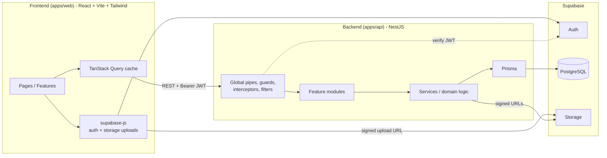

# Talibon Workspace — Architecture Plan

> *"Your work, your dashboard, your way."*
> Personalized Productivity, Planning and Progress Platform

| | |
|---|---|
| **Doc version** | 1.0 |
| **Date** | 2026-10-05 |
| **Source** | Talibon Workspace Business Pitch Plan |
| **Stack** | NestJS · PostgreSQL (Supabase) · React · Vite · Tailwind CSS |

---

## Table of Contents

1. [High-Level Architecture](#1-high-level-architecture)
2. [Architectural Decisions](#2-architectural-decisions)
3. [Request Lifecycle](#3-request-lifecycle)
4. [Repository Structure](#4-repository-structure)
5. [Layering Strategy](#5-layering-strategy)

---

## 1. High-Level Architecture

### 1.1 System Diagram



### 1.2 Architecture Overview

The system follows a **modular monolith** pattern with separate deployable frontend and backend applications:

- **Frontend**: React SPA built with Vite, TypeScript, and Tailwind CSS
- **Backend**: NestJS modular monolith with REST API
- **Database**: PostgreSQL managed by Supabase
- **Auth**: Supabase Auth with JWT verification in NestJS
- **Storage**: Supabase Storage with signed URLs

### 1.3 Key Architectural Principles

1. **Separation of Concerns**: Frontend and backend are independently deployable
2. **Workspace as Tenancy Boundary**: All data is scoped to a workspace
3. **Authorization in Backend**: NestJS enforces all business rules and permissions
4. **Defense in Depth**: RLS deny-all on database, authorization guards in API
5. **Data-Driven Customization**: Dashboard layout stored as data, not code

---

## 2. Architectural Decisions

| # | Decision | Rationale |
|---|---|---|
| ADR-1 | Frontend and backend are **separate deployable apps** (own `package.json`, build, env, deploy) | Independent scaling and releases |
| ADR-2 | Backend is a **modular monolith** | One deploy, clear module boundaries, can split later |
| ADR-3 | **Workspace is the tenancy boundary**; every domain table has `workspace_id` | Matches "context" idea; simple authorization |
| ADR-4 | Supabase Auth issues JWTs; Nest verifies them and maps `sub` to `profiles.id` | No custom password handling |
| ADR-5 | Nest connects to Postgres directly (pooled URL), bypassing RLS; **authorization is enforced in Nest** | Consistent business rules |
| ADR-6 | RLS enabled with **deny-all** for `anon`/`authenticated` roles | Defense in depth if the DB is ever exposed |
| ADR-7 | Frontend uploads files directly to Supabase Storage via **signed upload URLs** issued by the API | Keeps large files off the API |
| ADR-8 | Dashboard layout is **data** (`dashboard_widgets` rows), not code | Fulfills customization |
| ADR-9 | Custom trackers use **JSONB records** with field definitions | Flexible without runtime DDL |
| ADR-10 | Trend indicators and feedback are **computed server-side** and cached in `weekly_reports` | Consistent across clients |
| ADR-11 | Shared Zod/TS types live in an optional `packages/shared` | Single source of truth for contracts without coupling deploys |

---

## 3. Request Lifecycle

### 3.1 Backend Request Flow

```
Request
  → Helmet / CORS / rate limit
  → JwtAuthGuard           (verify Supabase JWT, load profile)
  → WorkspaceGuard         (resolve :workspaceId, load membership)
  → RolesGuard             (owner / admin / member / viewer)
  → PlanGuard / FeatureGuard (free vs premium gating)
  → ValidationPipe         (DTO)
  → Controller → Service → Prisma
  → ResponseInterceptor    (envelope)
  → AllExceptionsFilter    (error format)
```

### 3.2 Middleware Pipeline

1. **Security Layer**
   - Helmet for security headers
   - CORS configuration
   - Rate limiting (ThrottlerGuard)

2. **Authentication Layer**
   - JwtAuthGuard validates Supabase JWT
   - Attaches `req.user` with profile information

3. **Authorization Layer**
   - WorkspaceGuard validates workspace membership
   - RolesGuard checks role permissions
   - PlanGuard/FeatureGate enforces plan limits

4. **Validation Layer**
   - ValidationPipe validates DTOs
   - Whitelist mode to prevent mass assignment

5. **Business Logic Layer**
   - Controller handles HTTP concerns
   - Service implements business rules
   - Prisma handles data access

6. **Response Layer**
   - ResponseInterceptor wraps successes
   - AllExceptionsFilter normalizes errors

---

## 4. Repository Structure

### 4.1 Monorepo Layout

A single monorepo (pnpm workspaces) with two independent apps and an optional shared package.

```
talibon-workspace/
├── apps/
│   ├── api/                      # NestJS backend
│   │   ├── prisma/
│   │   │   ├── schema.prisma
│   │   │   ├── migrations/
│   │   │   └── seed.ts           # role templates, widget catalog, default categories
│   │   ├── src/
│   │   │   ├── main.ts
│   │   │   ├── app.module.ts
│   │   │   ├── config/           # env validation, configuration
│   │   │   ├── common/           # guards, decorators, filters, interceptors, pipes, dto
│   │   │   ├── infra/            # prisma, supabase client, storage, logger
│   │   │   └── modules/          # feature modules
│   │   ├── test/                 # e2e
│   │   └── package.json
│   └── web/                      # React + Vite frontend
│       ├── src/
│       │   ├── main.tsx
│       │   ├── app/              # providers, router, layouts
│       │   ├── features/         # feature slices
│       │   ├── widgets/          # widget registry + widget components
│       │   ├── components/       # shared UI (Button, Modal, DataTable...)
│       │   ├── lib/              # api client, supabase, utils
│       │   ├── hooks/
│       │   ├── stores/           # Zustand
│       │   └── styles/
│       ├── index.html
│       ├── tailwind.config.ts
│       ├── vite.config.ts
│       └── package.json
├── packages/
│   └── shared/                   # optional: Zod schemas, enums, API types
├── docs/
│   └── talibon-workspace-system-docs.md
├── .github/workflows/            # ci-api.yml, ci-web.yml
├── pnpm-workspace.yaml
└── README.md
```

### 4.2 Module Organization

Backend modules are organized by domain:
- **Core**: auth, profiles, workspaces, templates, modules-registry, dashboard
- **Productivity**: tasks, notes, calendar, goals, habits, time-tracking
- **Education**: subjects, classes, students, grades, lesson-plans, assignments, focus
- **Business**: products, customers, orders, finance
- **System**: documents, trackers, analytics, notifications, billing, ai, health

### 4.3 Frontend Feature Slices

Frontend features follow feature-sliced design:
- Each feature has its own folder with `api.ts`, `hooks.ts`, `components/`, `pages/`, `schemas.ts`
- Shared UI components live in `components/`
- Widget registry manages dashboard widgets

---

## 5. Layering Strategy

### 5.1 Backend Layering

```
Controller  → HTTP only: routing, DTOs, guards, Swagger decorators
Service     → business logic, transactions, authorization checks beyond guards
Repository  → (optional) Prisma queries for complex reads; simple CRUD uses Prisma in service
```

**Rules:**
- Controllers never touch Prisma directly
- Modules expose services, not repositories
- Cross-module access goes through exported services
- All database queries must include `workspaceId` filter

### 5.2 Frontend Layering

```
Pages/Features → Feature-specific UI and logic
Widgets        → Dashboard widget components
Components     → Reusable UI primitives
Lib            → API client, utilities, supabase integration
Hooks          → Custom React hooks
Stores         → Zustand stores for client state
```

**Rules:**
- Feature-specific UI stays in its feature folder
- Reusable components only in `components/`
- Server state managed by TanStack Query
- Client state managed by Zustand
- Auth state managed by Supabase context

### 5.3 Cross-Cutting Concerns

**Backend Common Layer:**
- Guards: JwtAuthGuard, WorkspaceGuard, RolesGuard, FeatureGuard
- Decorators: @CurrentUser(), @CurrentWorkspace(), @Roles(), @RequireFeature()
- Pipes: ValidationPipe
- Interceptors: ResponseInterceptor
- Filters: AllExceptionsFilter
- DTOs: PaginationDto, common response types

**Frontend Common Layer:**
- Providers: QueryClient, Auth, Theme, Toasts
- Layouts: AuthLayout, AppShell
- Utilities: API client, supabase client, error normalizer
- Hooks: useCurrentWorkspace, useDebounce, useOnlineStatus

---

## 6. Deployment Architecture

### 6.1 Environments

| Env | Frontend | Backend | Database |
|---|---|---|---|
| Local | Vite dev (`:5173`) | Nest dev (`:3000`) | Supabase local (CLI) or dev project |
| Staging | Static host preview | Container host | Supabase staging project |
| Production | Static host + CDN | Container host (region close to users, e.g., Singapore) | Supabase production project |

### 6.2 Hosting Options

**Frontend:** Vercel / Netlify / Cloudflare Pages
**Backend:** Railway / Render / Fly.io (Docker)

Both deploy independently to allow for separate scaling and release cycles.

### 6.3 CI/CD Pipeline

**Backend Pipeline (`ci-api`):**
1. Install dependencies
2. Lint
3. Typecheck
4. Unit tests
5. E2E tests (Postgres service container)
6. Build
7. Docker image

**Frontend Pipeline (`ci-web`):**
1. Install dependencies
2. Lint
3. Typecheck
4. Unit/component tests
5. Build
6. Playwright smoke (preview)

**Deployment:**
- `deploy-api`: on `main` → `prisma migrate deploy` → deploy container → health check
- `deploy-web`: on `main` → build → deploy static assets

Branching: trunk-based with short-lived feature branches; PRs require green CI and one review. Conventional commits.

---

## 7. Security Architecture

### 7.1 Authentication Flow

1. User authenticates via Supabase Auth (email/password or OAuth)
2. Supabase issues JWT access token
3. Frontend includes token in `Authorization: Bearer <token>` header
4. Backend JwtAuthGuard validates token signature and expiry
5. Token payload maps to `profiles.id` for user identification

### 7.2 Authorization Flow

1. WorkspaceGuard extracts `:workspaceId` from route
2. Loads `workspace_members` row to verify membership
3. Attaches `req.workspace` and `req.member` with role
4. RolesGuard checks if role has required permission
5. PlanGuard/FeatureGate checks if plan allows feature access

### 7.3 Data Isolation

- Every domain table has `workspace_id` foreign key
- All Prisma queries include `where: { workspaceId }` filter
- LLS (Row Level Security) enabled with deny-all policies
- Backend connects with service role, bypassing RLS
- Authorization enforced at application layer

### 7.4 File Security

- Private storage buckets for documents
- Signed URLs with short TTL for uploads/downloads
- MIME and size validation before upload
- Files never pass through backend API

---

## 8. Scalability Considerations

### 8.1 Current Scale (MVP)

- Single backend instance (modular monolith)
- CDN for static frontend assets
- Supabase for managed database and auth
- Horizontal scaling possible via container orchestration

### 8.2 Future Scale Options

**Backend:**
- Split modules into microservices if needed
- Add Redis for caching and session management
- Use message queue (BullMQ) for background jobs
- Implement read replicas for analytics queries

**Frontend:**
- Code splitting for larger bundles
- Service worker for offline capabilities
- Edge functions for regional deployment

**Database:**
- Connection pooling (PgBouncer) already in use
- Consider read replicas for reporting
- Archive old data for long-running instances

---

## 9. Observability

### 9.1 Logging

- Structured logs using Pino
- Request ID correlation across logs
- Log levels: error, warn, info, debug
- Sensitive data filtered from logs

### 9.2 Monitoring

- Health checks: `/health` (liveness), `/health/ready` (readiness)
- Uptime monitoring on health endpoints
- Sentry for error tracking (both frontend and backend)
- Performance monitoring (API response times, dashboard load time)

### 9.3 Analytics

- Product analytics for KPIs:
  - Registered users
  - Workspaces created
  - Weekly active users
  - Widgets per workspace
  - Tasks completed
  - Lesson plans saved/reused

---

*End of Architecture Plan*
