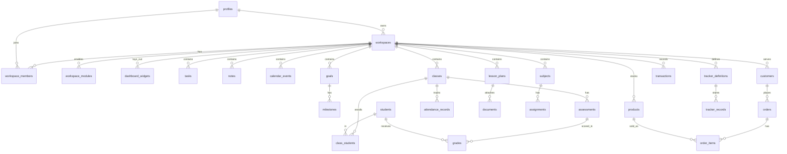

# Talibon Workspace — Schema Plan

> *"Your work, your dashboard, your way."*
> Personalized Productivity, Planning and Progress Platform

| | |
|---|---|
| **Doc version** | 1.0 |
| **Date** | 2026-10-05 |
| **Source** | Talibon Workspace Business Pitch Plan |
| **Stack** | NestJS · PostgreSQL (Supabase) · React · Vite · Tailwind CSS |

---

## Table of Contents

1. [Database Conventions](#1-database-conventions)
2. [Entity Relationship Overview](#2-entity-relationship-overview)
3. [Schema Tables](#3-schema-tables)
4. [Storage Buckets](#4-storage-buckets)
5. [Migrations and Seeding](#5-migrations-and-seeding)

---

## 1. Database Conventions

### 1.1 General Conventions

- **Primary keys**: `uuid` default `gen_random_uuid()`
- **Timestamps**: `created_at`, `updated_at` as `timestamptz`
- **Soft delete**: `deleted_at` where users may need recovery (tasks, notes, lesson plans, students)
- **Money**: `numeric(14,2)`, currency code stored on workspace (default `PHP`)
- **Workspace scoping**: Every domain table has `workspace_id uuid not null references workspaces(id) on delete cascade` and an index leading with `workspace_id`
- **Enums**: Postgres enums (or `text` + check constraint for faster iteration)
- **RLS**: Enabled on all tables, no policies for `anon`/`authenticated` (deny-all); API connects with the backend role

### 1.2 Extensions

```sql
create extension if not exists "pgcrypto";
create extension if not exists "pg_trgm";
```

### 1.3 Enum Types

```sql
create type member_role      as enum ('owner','admin','member','viewer');
create type template_key     as enum ('teacher','student','employee','freelancer','business','personal','custom');
create type task_status      as enum ('todo','in_progress','done','archived');
create type priority_level   as enum ('low','medium','high','urgent');
create type assignment_status as enum ('todo','in_progress','done');
create type attendance_status as enum ('present','absent','late','excused');
create type trend_status     as enum ('improving','consistent','needs_attention','significant_decline');
create type goal_type        as enum ('academic','professional','financial','personal','business');
create type txn_type         as enum ('income','expense','savings');
create type plan_tier        as enum ('free','premium','education','organization');
```

---

## 2. Entity Relationship Overview

### 2.1 ER Diagram



### 2.2 Key Relationships

- **Identity**: profiles → workspaces (1:N), profiles → workspace_members (1:N)
- **Workspace**: workspaces → all domain tables (1:N via workspace_id)
- **Education**: classes → students (M:N via class_students), classes → assessments (1:N), assessments → grades (1:N)
- **Business**: customers → orders (1:N), orders → order_items (1:N), products → order_items (1:N)
- **Goals**: goals → milestones (1:N), tasks → goals (N:1)
- **Trackers**: tracker_definitions → tracker_records (1:N)

---

## 3. Schema Tables

### 3.1 Identity and Workspaces

**profiles** - User profile, preferences
```sql
create table profiles (
  id            uuid primary key references auth.users(id) on delete cascade,
  full_name     text not null,
  avatar_url    text,
  primary_role  template_key,
  locale        text not null default 'en',
  timezone      text not null default 'Asia/Manila',
  preferences   jsonb not null default '{}',
  created_at    timestamptz not null default now(),
  updated_at    timestamptz not null default now()
);
```

**workspaces** - Workspace configuration, template, settings
```sql
create table workspaces (
  id            uuid primary key default gen_random_uuid(),
  owner_id      uuid not null references profiles(id),
  name          text not null,
  template      template_key not null default 'custom',
  icon          text,
  color         text,
  currency      char(3) not null default 'PHP',
  settings      jsonb not null default '{}',
  organization_id uuid,
  created_at    timestamptz not null default now(),
  updated_at    timestamptz not null default now(),
  deleted_at    timestamptz
);
create index on workspaces(owner_id);
```

**workspace_members** - Membership with roles
```sql
create table workspace_members (
  workspace_id  uuid references workspaces(id) on delete cascade,
  user_id       uuid references profiles(id) on delete cascade,
  role          member_role not null default 'member',
  invited_by    uuid references profiles(id),
  joined_at     timestamptz not null default now(),
  primary key (workspace_id, user_id)
);
```

**workspace_invitations** - Pending invitations
```sql
create table workspace_invitations (
  id            uuid primary key default gen_random_uuid(),
  workspace_id  uuid not null references workspaces(id) on delete cascade,
  email         text not null,
  role          member_role not null default 'member',
  token_hash    text not null,
  expires_at    timestamptz not null,
  accepted_at   timestamptz
);
```

### 3.2 Templates, Modules, Widgets

**module_catalog** - Available modules (global, seeded)
```sql
create table module_catalog (
  key           text primary key,
  name          text not null,
  category      text not null,
  description   text,
  min_tier      plan_tier not null default 'free'
);
```

**widget_catalog** - Widget types (global, seeded)
```sql
create table widget_catalog (
  type          text primary key,
  module_key    text not null references module_catalog(key),
  name          text not null,
  default_w     int not null default 4,
  default_h     int not null default 3,
  min_w         int not null default 2,
  min_h         int not null default 2,
  config_schema jsonb not null default '{}'
);
```

**role_templates** - Role templates (Teacher, Student, etc.)
```sql
create table role_templates (
  key           template_key primary key,
  name          text not null,
  modules       text[] not null,
  widgets       jsonb  not null,
  seed_data     jsonb  not null default '{}'
);
```

**workspace_modules** - Per-workspace module enablement
```sql
create table workspace_modules (
  workspace_id  uuid references workspaces(id) on delete cascade,
  module_key    text references module_catalog(key),
  enabled       boolean not null default true,
  settings      jsonb not null default '{}',
  primary key (workspace_id, module_key)
);
```

**dashboard_settings** - Dashboard configuration
```sql
create table dashboard_settings (
  workspace_id  uuid primary key references workspaces(id) on delete cascade,
  priority_module text,
  layout_mode   text not null default 'grid',
  updated_at    timestamptz not null default now()
);
```

**dashboard_widgets** - Widget instances with layout
```sql
create table dashboard_widgets (
  id            uuid primary key default gen_random_uuid(),
  workspace_id  uuid not null references workspaces(id) on delete cascade,
  widget_type   text not null references widget_catalog(type),
  title         text,
  config        jsonb not null default '{}',
  x int not null default 0, y int not null default 0,
  w int not null default 4, h int not null default 3,
  zone          text not null default 'main',
  position      int not null default 0,
  visible       boolean not null default true,
  created_at    timestamptz not null default now()
);
create index on dashboard_widgets(workspace_id, position);
```

### 3.3 Core Modules

**tasks** - Tasks with projects, priorities, estimates
```sql
create table projects (
  id uuid primary key default gen_random_uuid(),
  workspace_id uuid not null references workspaces(id) on delete cascade,
  name text not null, description text, color text,
  status text not null default 'active',
  due_date date,
  created_at timestamptz not null default now(), updated_at timestamptz not null default now()
);

create table tasks (
  id uuid primary key default gen_random_uuid(),
  workspace_id uuid not null references workspaces(id) on delete cascade,
  project_id uuid references projects(id) on delete set null,
  goal_id uuid,
  milestone_id uuid,
  assignee_id uuid references profiles(id),
  parent_task_id uuid references tasks(id) on delete cascade,
  title text not null,
  description text,
  status task_status not null default 'todo',
  priority priority_level not null default 'medium',
  due_at timestamptz,
  estimated_minutes int,
  completed_at timestamptz,
  sort_order int not null default 0,
  created_by uuid references profiles(id),
  created_at timestamptz not null default now(), updated_at timestamptz not null default now(),
  deleted_at timestamptz
);
create index on tasks(workspace_id, status, due_at);
```

**notes** - Notes with categories and rich text
```sql
create table note_categories (
  id uuid primary key default gen_random_uuid(),
  workspace_id uuid not null references workspaces(id) on delete cascade,
  parent_id uuid references note_categories(id) on delete cascade,
  name text not null, color text, sort_order int default 0
);

create table notes (
  id uuid primary key default gen_random_uuid(),
  workspace_id uuid not null references workspaces(id) on delete cascade,
  category_id uuid references note_categories(id) on delete set null,
  title text not null,
  content jsonb,
  content_text text,
  pinned boolean not null default false,
  created_by uuid references profiles(id),
  created_at timestamptz not null default now(), updated_at timestamptz not null default now(),
  deleted_at timestamptz
);
create index notes_search on notes using gin (content_text gin_trgm_ops);
```

**calendar_events** - Events with recurrence
```sql
create table calendar_events (
  id uuid primary key default gen_random_uuid(),
  workspace_id uuid not null references workspaces(id) on delete cascade,
  title text not null, description text, location text,
  starts_at timestamptz not null, ends_at timestamptz,
  all_day boolean not null default false,
  recurrence_rule text,
  source_type text, source_id uuid,
  reminder_minutes int[],
  created_by uuid references profiles(id),
  created_at timestamptz not null default now()
);
create index on calendar_events(workspace_id, starts_at);
```

**goals** - Goals with milestones and progress
```sql
create table goals (
  id uuid primary key default gen_random_uuid(),
  workspace_id uuid not null references workspaces(id) on delete cascade,
  title text not null, description text,
  type goal_type not null default 'personal',
  target_value numeric, current_value numeric default 0, unit text,
  progress_pct numeric(5,2) not null default 0,
  target_date date,
  status text not null default 'active',
  created_at timestamptz not null default now(), updated_at timestamptz not null default now()
);

create table milestones (
  id uuid primary key default gen_random_uuid(),
  goal_id uuid not null references goals(id) on delete cascade,
  workspace_id uuid not null references workspaces(id) on delete cascade,
  title text not null, weight int not null default 1,
  progress_pct numeric(5,2) not null default 0,
  status text not null default 'pending',
  sort_order int default 0
);
alter table tasks add constraint tasks_goal_fk foreign key (goal_id) references goals(id) on delete set null;
alter table tasks add constraint tasks_ms_fk   foreign key (milestone_id) references milestones(id) on delete set null;
```

**habits** - Habit tracking
```sql
create table habits (
  id uuid primary key default gen_random_uuid(),
  workspace_id uuid not null references workspaces(id) on delete cascade,
  name text not null, frequency text not null default 'daily', target_per_period int default 1,
  archived boolean default false
);

create table habit_logs (
  habit_id uuid references habits(id) on delete cascade,
  log_date date, count int default 1,
  primary key (habit_id, log_date)
);
```

**time_entries** - Time tracking
```sql
create table time_entries (
  id uuid primary key default gen_random_uuid(),
  workspace_id uuid not null references workspaces(id) on delete cascade,
  user_id uuid not null references profiles(id),
  task_id uuid references tasks(id) on delete set null,
  category text,
  started_at timestamptz not null, ended_at timestamptz,
  duration_minutes int
);
```

**documents** - File attachments
```sql
create table documents (
  id uuid primary key default gen_random_uuid(),
  workspace_id uuid not null references workspaces(id) on delete cascade,
  name text not null,
  storage_path text not null,
  mime_type text, size_bytes bigint,
  entity_type text, entity_id uuid,
  uploaded_by uuid references profiles(id),
  created_at timestamptz not null default now(),
  deleted_at timestamptz
);
create index on documents(workspace_id, entity_type, entity_id);
```

### 3.4 Education

**subjects** - Subjects
```sql
create table subjects (
  id uuid primary key default gen_random_uuid(),
  workspace_id uuid not null references workspaces(id) on delete cascade,
  name text not null, color text, teacher_name text
);
```

**classes** - Classes with schedules
```sql
create table classes (
  id uuid primary key default gen_random_uuid(),
  workspace_id uuid not null references workspaces(id) on delete cascade,
  subject_id uuid references subjects(id),
  name text not null, grade_level text, section text, school_year text,
  schedule jsonb not null default '[]'
);
```

**students** - Student records
```sql
create table students (
  id uuid primary key default gen_random_uuid(),
  workspace_id uuid not null references workspaces(id) on delete cascade,
  first_name text not null, last_name text not null,
  student_no text, guardian_contact text, notes text,
  created_at timestamptz not null default now(), deleted_at timestamptz
);

create table class_students (
  class_id uuid references classes(id) on delete cascade,
  student_id uuid references students(id) on delete cascade,
  primary key (class_id, student_id)
);
```

**attendance_records** - Attendance tracking
```sql
create table attendance_records (
  id uuid primary key default gen_random_uuid(),
  workspace_id uuid not null references workspaces(id) on delete cascade,
  class_id uuid not null references classes(id) on delete cascade,
  student_id uuid not null references students(id) on delete cascade,
  date date not null,
  status attendance_status not null,
  unique (class_id, student_id, date)
);
```

**assessments** - Quizzes, exams, activities
```sql
create table assessments (
  id uuid primary key default gen_random_uuid(),
  workspace_id uuid not null references workspaces(id) on delete cascade,
  class_id uuid not null references classes(id) on delete cascade,
  title text not null, category text,
  quarter smallint, max_score numeric not null default 100, weight numeric default 1,
  date date
);

create table grades (
  assessment_id uuid references assessments(id) on delete cascade,
  student_id uuid references students(id) on delete cascade,
  workspace_id uuid not null references workspaces(id) on delete cascade,
  score numeric, remarks text,
  primary key (assessment_id, student_id)
);
```

**student_progress** - Computed progress with trends
```sql
create table student_progress (
  class_id uuid references classes(id) on delete cascade,
  student_id uuid references students(id) on delete cascade,
  period_start date, period_end date,
  average_grade numeric(5,2), attendance_rate numeric(5,2), completion_rate numeric(5,2),
  trend trend_status not null,
  computed_at timestamptz not null default now(),
  primary key (class_id, student_id, period_end)
);
```

**lesson_plan_templates** - Lesson plan templates
```sql
create table lesson_plan_templates (
  id uuid primary key default gen_random_uuid(),
  workspace_id uuid references workspaces(id) on delete cascade,
  name text not null, structure jsonb not null
);
```

**lesson_plans** - Lesson plans with attachments
```sql
create table lesson_plans (
  id uuid primary key default gen_random_uuid(),
  workspace_id uuid not null references workspaces(id) on delete cascade,
  class_id uuid references classes(id) on delete set null,
  template_id uuid references lesson_plan_templates(id),
  source_plan_id uuid references lesson_plans(id),
  subject text, grade_level text, quarter smallint,
  topic text not null,
  learning_objectives text, materials text, activities text,
  discussion text, assessment text, assignment text, reflection text,
  planned_date date,
  status text not null default 'draft',
  created_at timestamptz not null default now(), updated_at timestamptz not null default now(),
  deleted_at timestamptz
);
```

**assignments** - Student assignments
```sql
create table assignments (
  id uuid primary key default gen_random_uuid(),
  workspace_id uuid not null references workspaces(id) on delete cascade,
  subject_id uuid references subjects(id),
  title text not null, description text,
  deadline timestamptz not null,
  priority priority_level not null default 'medium',
  estimated_minutes int not null default 60,
  status assignment_status not null default 'todo',
  completed_at timestamptz,
  created_at timestamptz not null default now()
);
create index on assignments(workspace_id, status, deadline);
```

**focus_sessions** - Focus tracking (opt-in)
```sql
create table focus_sessions (
  id uuid primary key default gen_random_uuid(),
  workspace_id uuid not null references workspaces(id) on delete cascade,
  user_id uuid not null references profiles(id),
  kind text not null default 'study',
  label text,
  started_at timestamptz not null, ended_at timestamptz,
  duration_minutes int
);
```

### 3.5 Business and Finance

**products** - Inventory with stock levels
```sql
create table products (
  id uuid primary key default gen_random_uuid(),
  workspace_id uuid not null references workspaces(id) on delete cascade,
  name text not null, sku text, unit text,
  cost_price numeric(14,2) not null default 0, sell_price numeric(14,2) not null default 0,
  quantity numeric not null default 0, reorder_level numeric not null default 0,
  archived boolean default false
);

create table stock_movements (
  id uuid primary key default gen_random_uuid(),
  workspace_id uuid not null references workspaces(id) on delete cascade,
  product_id uuid not null references products(id) on delete cascade,
  change numeric not null, reason text,
  created_at timestamptz not null default now()
);
```

**customers** - Customer records
```sql
create table customers (
  id uuid primary key default gen_random_uuid(),
  workspace_id uuid not null references workspaces(id) on delete cascade,
  name text not null, phone text, address text, notes text
);
```

**orders** - Orders with items
```sql
create table orders (
  id uuid primary key default gen_random_uuid(),
  workspace_id uuid not null references workspaces(id) on delete cascade,
  customer_id uuid references customers(id) on delete set null,
  status text not null default 'completed',
  total numeric(14,2) not null default 0, total_cost numeric(14,2) not null default 0,
  ordered_at timestamptz not null default now(), notes text
);

create table order_items (
  id uuid primary key default gen_random_uuid(),
  order_id uuid not null references orders(id) on delete cascade,
  product_id uuid references products(id) on delete set null,
  name text not null, qty numeric not null,
  unit_price numeric(14,2) not null, unit_cost numeric(14,2) not null default 0
);
```

**transactions** - Financial transactions
```sql
create table transaction_categories (
  id uuid primary key default gen_random_uuid(),
  workspace_id uuid not null references workspaces(id) on delete cascade,
  name text not null, type txn_type not null
);

create table transactions (
  id uuid primary key default gen_random_uuid(),
  workspace_id uuid not null references workspaces(id) on delete cascade,
  category_id uuid references transaction_categories(id),
  type txn_type not null, amount numeric(14,2) not null,
  note text, occurred_on date not null
);
create index on transactions(workspace_id, occurred_on);
```

### 3.6 Custom Trackers

**tracker_definitions** - Custom tracker schemas
```sql
create table tracker_definitions (
  id uuid primary key default gen_random_uuid(),
  workspace_id uuid not null references workspaces(id) on delete cascade,
  name text not null, description text, icon text,
  fields jsonb not null,
  created_at timestamptz not null default now()
);
```

**tracker_records** - Tracker data (JSONB)
```sql
create table tracker_records (
  id uuid primary key default gen_random_uuid(),
  tracker_id uuid not null references tracker_definitions(id) on delete cascade,
  workspace_id uuid not null references workspaces(id) on delete cascade,
  data jsonb not null,
  created_at timestamptz not null default now(), updated_at timestamptz not null default now()
);
create index tracker_records_data on tracker_records using gin (data);
```

### 3.7 Analytics and Billing

**weekly_reports** - Computed weekly reports
```sql
create table weekly_reports (
  id uuid primary key default gen_random_uuid(),
  workspace_id uuid not null references workspaces(id) on delete cascade,
  user_id uuid not null references profiles(id),
  week_start date not null,
  metrics jsonb not null,
  feedback jsonb not null default '[]',
  generated_at timestamptz not null default now(),
  unique (workspace_id, user_id, week_start)
);
```

**notifications** - User notifications
```sql
create table notifications (
  id uuid primary key default gen_random_uuid(),
  user_id uuid not null references profiles(id) on delete cascade,
  workspace_id uuid references workspaces(id) on delete cascade,
  type text not null, title text not null, body text, payload jsonb,
  read_at timestamptz, created_at timestamptz not null default now()
);
```

**subscriptions** - Plan subscriptions
```sql
create table subscriptions (
  id uuid primary key default gen_random_uuid(),
  owner_type text not null,
  owner_id uuid not null,
  tier plan_tier not null default 'free',
  status text not null default 'active',
  seats int, current_period_end timestamptz,
  provider text, provider_ref text
);
```

---

## 4. Storage Buckets

### 4.1 Bucket Configuration

| Bucket | Visibility | Path convention |
|---|---|---|
| `documents` | private | `{workspace_id}/{entity_type}/{entity_id}/{uuid}-{filename}` |
| `avatars` | public-read | `{user_id}/avatar.{ext}` |

### 4.2 File Upload Flow

1. Frontend requests signed upload URL from API
2. API validates permissions and returns signed URL
3. Frontend uploads directly to Supabase Storage
4. Frontend registers file metadata with API
5. API stores metadata in `documents` table

### 4.3 File Download Flow

1. Frontend requests download URL from API
2. API validates access permissions
3. API returns short-lived signed URL
4. Frontend downloads directly from Supabase Storage

---

## 5. Migrations and Seeding

### 5.1 Migration Strategy

- **Tool**: Prisma Migrate
- **Development**: `prisma migrate dev` - generates and applies migrations locally
- **Production**: `prisma migrate deploy` - applies migrations in CI/CD
- **Source of truth**: `prisma/schema.prisma` - DDL reference in docs is for documentation only

### 5.2 Connection Strings

- **Direct connection**: Used for migrations (`DIRECT_URL`)
- **Pooled connection**: Used for running app (`DATABASE_URL` with `?pgbouncer=true`)
- **Reason**: Migrations need direct access; app uses PgBouncer for connection pooling

### 5.3 Seed Data

**Seed script** (`prisma/seed.ts`) populates:

1. **module_catalog** - Available modules (tasks, notes, calendar, goals, classes, students, grades, lesson_plans, assignments, products, customers, orders, finance, trackers)
2. **widget_catalog** - Widget types for each module
3. **role_templates** - Teacher, Student, Employee, Freelancer, Business, Personal, Custom templates with default modules, widgets, and seed data
4. **lesson_plan_templates** - System templates (Lecture, Activity, Discussion, Laboratory, Group work, Assessment day)

### 5.4 Seeding Commands

```bash
# Development
npx prisma db seed

# Production (after deploy)
npx prisma db seed --preview-feature
```

### 5.5 Migration Workflow

1. Modify `prisma/schema.prisma`
2. Run `npx prisma migrate dev --name <description>`
3. Review generated migration SQL
4. Test migration locally
5. Commit both schema and migration files
6. CI/CD runs `prisma migrate deploy` on production

### 5.6 Rollback Strategy

- Prisma Migrate does not support automatic rollbacks
- For critical issues, create a new migration to revert changes
- Always test migrations on staging before production
- Keep backups of previous schema versions

---

## 6. Database Security

### 6.1 Row Level Security (RLS)

```sql
-- Enable RLS on all tables
-- alter table <each table> enable row level security;

-- Deny-all policies for anon and authenticated roles
-- create policy "anon_deny_all" on <table> for all to anon using (false);
-- create policy "authenticated_deny_all" on <table> for all to authenticated using (false);
```

### 6.2 Backend Role

- API connects with backend role (bypasses RLS)
- Authorization enforced at application layer via guards
- Defense in depth: RLS provides protection if DB is ever exposed directly

### 6.3 Data Protection

- All sensitive fields encrypted at rest by Supabase
- TLS for all connections
- Connection pooling via PgBouncer
- Automatic backups by Supabase

---

*End of Schema Plan*
