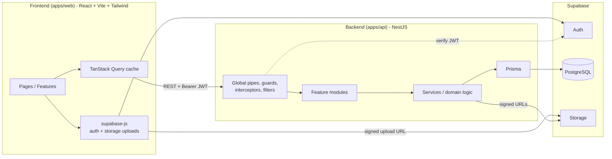
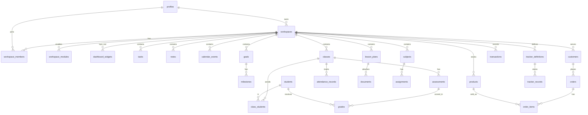

# Talibon Workspace — System Documentation
 
> *"Your work, your dashboard, your way."*
> Personalized Productivity, Planning and Progress Platform
 
| | |
|---|---|
| **Doc version** | 1.0 (draft) |
| **Date** | 2026-10-05 |
| **Source** | Talibon Workspace Business Pitch Plan |
| **Stack** | NestJS · PostgreSQL (Supabase) · React · Vite · Tailwind CSS |
 
---
 
## Table of Contents
 
1. [Project Overview](#1-project-overview)
2. [Scope and Requirements](#2-scope-and-requirements)
3. [Tech Stack](#3-tech-stack)
4. [System Architecture](#4-system-architecture)
5. [Repository Structure](#5-repository-structure)
6. [Backend Design (NestJS)](#6-backend-design-nestjs)
7. [Database Schema (PostgreSQL / Supabase)](#7-database-schema-postgresql--supabase)
8. [API Specification](#8-api-specification)
9. [Frontend Design (React + Vite + Tailwind)](#9-frontend-design-react--vite--tailwind)
10. [Widget System](#10-widget-system)
11. [Security, Privacy and Permissions](#11-security-privacy-and-permissions)
12. [DevOps, Environments and Deployment](#12-devops-environments-and-deployment)
13. [Testing Strategy](#13-testing-strategy)
14. [Project Completion Plan](#14-project-completion-plan)
15. [Risks, KPIs and Open Questions](#15-risks-kpis-and-open-questions)
---
 
## 1. Project Overview
 
Talibon Workspace is a customizable digital platform where each user builds a dashboard around their role, goals and responsibilities. A teacher, student, employee, freelancer or small business owner uses the same platform and sees completely different things.
 
It is **not** a teacher app or a student app. It is a system made of **modules** (functional blocks) and **widgets** (visual pieces on the dashboard) that users add, arrange and resize.
 
### Core ideas
 
| Idea | Meaning |
|---|---|
| Role-aware starting point | Templates: Teacher, Student, Employee, Freelancer, Business, Personal, Custom |
| Modules | Functional blocks: Tasks, Notes, Calendar, Goals, Students, Grades, Inventory, Sales, Finance... |
| Widgets | Dashboard tiles of a module: add, move, resize |
| Context | Multiple workspaces per user (School, Personal, Master's) |
 
### Position in the Talibon ecosystem
 
Workspace is the **individual productivity layer**. Talibon Intra-Office covers organizational operations. Unlike Bao Bao App, Workspace is not limited to Talibon and can serve any school, business or person.
 
### Design principles
 
1. **Customization plus context** is the product, not the task list.
2. **Workspace-scoped everything**: every record belongs to exactly one workspace.
3. **Meaningful numbers**: trends, workload hours and progress-based feedback instead of raw counts.
4. **Privacy first**: focus/screen-time tracking is strictly opt-in; collect only what is needed.
5. **MVP first**: do not build everything at once; AI is optional and last.
6. **Lightweight and offline-tolerant** for slow or unstable internet.
---
 
## 2. Scope and Requirements
 
### 2.1 MVP scope (Phases 1–2)
 
| Track | Contents |
|---|---|
| Core | Account, workspace creation, templates, dashboard, widget system, tasks, notes, calendar, goals, basic analytics |
| Teacher MVP | Classes, students, grades, lesson plans (with templates, duplicate/reuse) |
| Student MVP | Subjects, assignments, deadlines, study goals, workload estimate |
 
### 2.2 Post-MVP
 
Documents, focus/screen-time tracker, personal finance, business tools (sales, inventory, customers, orders), custom trackers, advanced analytics, school package, Intra-Office integration, AI assistant.
 
### 2.3 Functional requirements (summary)
 
| ID | Requirement |
|---|---|
| FR-1 | Users register/login, have one account with many workspaces |
| FR-2 | Create a workspace from a role template or blank (Custom) |
| FR-3 | Enable/disable modules per workspace |
| FR-4 | Dashboard with draggable, resizable widgets; priority setting reorders layout |
| FR-5 | Tasks, notes (grouped by context), calendar events, goals with milestones |
| FR-6 | Teacher: classes, students, attendance, grades, lesson plan manager with templates |
| FR-7 | Student: assignments sorted Today/This week/Later, workload in estimated hours |
| FR-8 | Progress indicators: Improving, Consistent, Needs attention, Significant decline |
| FR-9 | Progress-based feedback messages and weekly analytics report |
| FR-10 | Documents attached to the work they belong to (e.g., a lesson plan) |
| FR-11 | Finance, sales, inventory, customers, orders (Phase 4) |
| FR-12 | Custom trackers with user-defined fields (Phase 4) |
| FR-13 | Opt-in focus/screen-time tracking (Phase 3) |
| FR-14 | Freemium tiers with feature gating (Free / Premium / Education / Organization) |
 
### 2.4 Non-functional requirements
 
| Area | Target |
|---|---|
| Performance | Dashboard first load under 2.5s on 3G-class connections; API p95 under 300ms |
| Availability | 99.5% for MVP |
| Offline | Drafts (notes, lesson plans, tasks) saved locally, synced when online |
| Security | JWT auth, workspace-scoped authorization, RLS as defense in depth |
| Accessibility | WCAG 2.1 AA for core flows |
| Localization | English first; structure i18n-ready (Filipino next); currency PHP default |
 
---
 
## 3. Tech Stack
 
| Layer | Choice | Notes |
|---|---|---|
| Frontend | **React 18 + TypeScript** | SPA |
| Build tool | **Vite** | Fast dev server, code splitting |
| Styling | **Tailwind CSS** | Design tokens in `tailwind.config`; optional `shadcn/ui` (Radix) for primitives |
| Routing | React Router v6 | Workspace-scoped routes |
| Server state | TanStack Query | Caching, optimistic updates, offline persistence |
| Client state | Zustand | UI state, current workspace, dashboard edit mode |
| Forms | React Hook Form + Zod | Shared schemas |
| Grid / DnD | `react-grid-layout` | Widget move/resize |
| Charts | Recharts | Analytics widgets |
| Rich text | TipTap | Notes and lesson plan fields |
| Backend | **NestJS (TypeScript)** | Modular monolith, REST |
| ORM | Prisma | Migrations and typed client (Drizzle is an acceptable alternative) |
| Validation | class-validator / class-transformer (or Zod pipe) | DTOs |
| API docs | `@nestjs/swagger` | OpenAPI served at `/api/docs` |
| Database | **PostgreSQL on Supabase** | Managed Postgres, pooled connection |
| Auth | **Supabase Auth** | Email/password and OAuth; Nest verifies Supabase JWT |
| File storage | Supabase Storage | Private buckets, signed URLs |
| Jobs / scheduling | `@nestjs/schedule` (later BullMQ + Redis if needed) | Weekly reports, reminders |
| Logging | Pino (`nestjs-pino`) | Structured logs |
| Testing | Jest, Supertest, Vitest, React Testing Library, Playwright | See §13 |
| Tooling | pnpm, ESLint, Prettier, Husky, lint-staged, GitHub Actions | |
 
**Why a separate NestJS backend when Supabase exists?** Business rules (workload estimates, trend indicators, feature gating, templates, multi-workspace permissions) belong in a testable service layer. Supabase is used for what it is best at: managed Postgres, Auth and Storage. The React app never queries tables directly.
 
---
 
## 4. System Architecture
 
### 4.1 High-level diagram
 

 
### 4.2 Architectural decisions
 
| # | Decision | Rationale |
|---|---|---|
| ADR-1 | Frontend and backend are **separate deployable apps** (own `package.json`, build, env, deploy) | Independent scaling and releases |
| ADR-2 | Backend is a **modular monolith** | One deploy, clear module boundaries, can split later |
| ADR-3 | **Workspace is the tenancy boundary**; every domain table has `workspace_id` | Matches "context" idea; simple authorization |
| ADR-4 | Supabase Auth issues JWTs; Nest verifies them and maps `sub` to `profiles.id` | No custom password handling |
| ADR-5 | Nest connects to Postgres directly (pooled URL), bypassing RLS; **authorization is enforced in Nest** | Consistent business rules |
| ADR-6 | RLS enabled with **deny-all** for `anon`/`authenticated` roles | Defense in depth if the DB is ever exposed |
| ADR-7 | Frontend uploads files directly to Supabase Storage via **signed upload URLs** issued by the API | Keeps large files off the API |
| ADR-8 | Dashboard layout is **data** (`dashboard_widgets` rows), not code | Fulfills customization |
| ADR-9 | Custom trackers use **JSONB records** with field definitions | Flexible without runtime DDL |
| ADR-10 | Trend indicators and feedback are **computed server-side** and cached in `weekly_reports` | Consistent across clients |
| ADR-11 | Shared Zod/TS types live in an optional `packages/shared` | Single source of truth for contracts without coupling deploys |
 
### 4.3 Request lifecycle (backend)
 
```
Request
  → Helmet / CORS / rate limit
  → JwtAuthGuard           (verify Supabase JWT, load profile)
  → WorkspaceGuard         (resolve :workspaceId, load membership)
  → RolesGuard             (owner / admin / member / viewer)
  → PlanGuard / FeatureGuard (free vs premium gating)
  → ValidationPipe         (DTO)
  → Controller → Service → Prisma
  → ResponseInterceptor    (envelope)
  → AllExceptionsFilter    (error format)
```
 
---
 
## 5. Repository Structure
 
A single monorepo (pnpm workspaces) with two independent apps and an optional shared package.
 
```
talibon-workspace/
├── apps/
│   ├── api/                      # NestJS backend
│   │   ├── prisma/
│   │   │   ├── schema.prisma
│   │   │   ├── migrations/
│   │   │   └── seed.ts           # role templates, widget catalog, default categories
│   │   ├── src/
│   │   │   ├── main.ts
│   │   │   ├── app.module.ts
│   │   │   ├── config/           # env validation, configuration
│   │   │   ├── common/           # guards, decorators, filters, interceptors, pipes, dto
│   │   │   ├── infra/            # prisma, supabase client, storage, logger
│   │   │   └── modules/          # feature modules (see §6)
│   │   ├── test/                 # e2e
│   │   └── package.json
│   └── web/                      # React + Vite frontend
│       ├── src/
│       │   ├── main.tsx
│       │   ├── app/              # providers, router, layouts
│       │   ├── features/         # feature slices (see §9)
│       │   ├── widgets/          # widget registry + widget components
│       │   ├── components/       # shared UI (Button, Modal, DataTable...)
│       │   ├── lib/              # api client, supabase, utils
│       │   ├── hooks/
│       │   ├── stores/           # Zustand
│       │   └── styles/
│       ├── index.html
│       ├── tailwind.config.ts
│       ├── vite.config.ts
│       └── package.json
├── packages/
│   └── shared/                   # optional: Zod schemas, enums, API types
├── docs/
│   └── talibon-workspace-system-docs.md
├── .github/workflows/            # ci-api.yml, ci-web.yml
├── pnpm-workspace.yaml
└── README.md
```
 
---
 
## 6. Backend Design (NestJS)
 
### 6.1 Layering
 
```
Controller  → HTTP only: routing, DTOs, guards, Swagger decorators
Service     → business logic, transactions, authorization checks beyond guards
Repository  → (optional) Prisma queries for complex reads; simple CRUD uses Prisma in service
```
 
Rules: controllers never touch Prisma; modules expose services, not repositories; cross-module access goes through exported services.
 
### 6.2 Module map
 
```
src/modules/
├── auth/             # JWT strategy, /me
├── profiles/         # user profile, preferences
├── workspaces/       # CRUD, members, invitations
├── templates/        # role templates (Teacher, Student, ...)
├── modules-registry/ # available modules + per-workspace enablement
├── dashboard/        # dashboard settings, widgets, layout, aggregated data
├── tasks/            # tasks, projects, task lists
├── notes/            # notes, note categories
├── calendar/         # events, reminders
├── goals/            # goals, milestones
├── habits/           # habit tracker
├── time-tracking/    # time entries
├── documents/        # files, attachments, signed URLs
├── education/
│   ├── subjects/
│   ├── classes/
│   ├── students/     # includes attendance
│   ├── grades/       # assessments + scores
│   ├── lesson-plans/ # plans, templates, duplicate
│   ├── assignments/  # student assignments + workload
│   └── focus/        # focus sessions (opt-in)
├── business/
│   ├── products/     # inventory + stock movements
│   ├── customers/
│   ├── orders/       # orders + sales
│   └── finance/      # transactions, categories
├── trackers/         # custom trackers + records
├── analytics/        # weekly reports, trends, feedback
├── notifications/
├── billing/          # plans, subscriptions, entitlements
├── ai/               # reserved (Phase 6)
└── health/           # liveness / readiness
```
 
### 6.3 Cross-cutting components (`common/`)
 
| Component | Purpose |
|---|---|
| `JwtAuthGuard` | Validates Supabase JWT (JWKS or JWT secret), attaches `req.user` |
| `WorkspaceGuard` | Reads `:workspaceId`, loads `workspace_members` row, attaches `req.workspace` and `req.member` |
| `RolesGuard` + `@Roles()` | Role check within workspace |
| `FeatureGuard` + `@RequireFeature('analytics.advanced')` | Plan entitlement gating |
| `@CurrentUser()` / `@CurrentWorkspace()` | Param decorators |
| `PaginationDto` | `page`, `limit`, `sort`, `order`, `q` |
| `ResponseInterceptor` | Wraps successes in `{ data, meta }` |
| `AllExceptionsFilter` | Normalizes errors (see §8.1) |
| `ThrottlerGuard` | Rate limiting |
 
### 6.4 Domain rules implemented in services
 
| Rule | Where | Behavior |
|---|---|---|
| Workload estimate | `assignments` | Sum `estimated_minutes` of non-done assignments; group Today (due ≤ tomorrow), This week, Later; flag the largest item |
| Trend indicator | `analytics` | Compare recent window average with prior window; map delta to Improving / Consistent / Needs attention / Significant decline (thresholds configurable) |
| Progress feedback | `analytics` | Generate message only when backed by a real delta (e.g., "4 assignments, 2 more than last week"); otherwise return nothing |
| Lesson plan reuse | `lesson-plans` | Duplicate copies fields, resets dates, optionally copies attachments |
| Stock alerts | `products` | `low_stock` when `quantity <= reorder_level` |
| Profit | `orders` / `finance` | Profit = revenue − cost per period |
| Template apply | `templates` | Creates modules + widgets + sample categories in one transaction |
| Feature gating | `billing` | Free: 1 workspace, basic modules, limited widgets |
 
---
 
## 7. Database Schema (PostgreSQL / Supabase)
 
### 7.1 Conventions
 
- Primary keys: `uuid` default `gen_random_uuid()`.
- Timestamps: `created_at`, `updated_at` as `timestamptz`; soft delete via `deleted_at` where users may need recovery (tasks, notes, lesson plans, students).
- Money: `numeric(14,2)`, currency code stored on workspace (default `PHP`).
- Every domain table has `workspace_id uuid not null references workspaces(id) on delete cascade` and an index leading with `workspace_id`.
- Enums as Postgres enums (or `text` + check constraint for faster iteration).
- RLS enabled on all tables, no policies for `anon`/`authenticated` (deny-all); API connects with the backend role.
### 7.2 Entity relationship overview
 

 
### 7.3 Schema (DDL reference)
 
> This is the reference design. The source of truth in code will be `prisma/schema.prisma`; migrations are generated from it.
 
```sql
-- ===== Extensions & enums =====
create extension if not exists "pgcrypto";
create extension if not exists "pg_trgm";
 
create type member_role      as enum ('owner','admin','member','viewer');
create type template_key     as enum ('teacher','student','employee','freelancer','business','personal','custom');
create type task_status      as enum ('todo','in_progress','done','archived');
create type priority_level   as enum ('low','medium','high','urgent');
create type assignment_status as enum ('todo','in_progress','done');
create type attendance_status as enum ('present','absent','late','excused');
create type trend_status     as enum ('improving','consistent','needs_attention','significant_decline');
create type goal_type        as enum ('academic','professional','financial','personal','business');
create type txn_type         as enum ('income','expense','savings');
create type plan_tier        as enum ('free','premium','education','organization');
 
-- ===== Identity =====
create table profiles (                      -- 1:1 with auth.users
  id            uuid primary key references auth.users(id) on delete cascade,
  full_name     text not null,
  avatar_url    text,
  primary_role  template_key,
  locale        text not null default 'en',
  timezone      text not null default 'Asia/Manila',
  preferences   jsonb not null default '{}',
  created_at    timestamptz not null default now(),
  updated_at    timestamptz not null default now()
);
 
-- ===== Workspaces =====
create table workspaces (
  id            uuid primary key default gen_random_uuid(),
  owner_id      uuid not null references profiles(id),
  name          text not null,
  template      template_key not null default 'custom',
  icon          text,
  color         text,
  currency      char(3) not null default 'PHP',
  settings      jsonb not null default '{}',          -- e.g. {"focusTrackingEnabled": false}
  organization_id uuid,                               -- future Intra-Office / school link
  created_at    timestamptz not null default now(),
  updated_at    timestamptz not null default now(),
  deleted_at    timestamptz
);
create index on workspaces(owner_id);
 
create table workspace_members (
  workspace_id  uuid references workspaces(id) on delete cascade,
  user_id       uuid references profiles(id) on delete cascade,
  role          member_role not null default 'member',
  invited_by    uuid references profiles(id),
  joined_at     timestamptz not null default now(),
  primary key (workspace_id, user_id)
);
 
create table workspace_invitations (
  id            uuid primary key default gen_random_uuid(),
  workspace_id  uuid not null references workspaces(id) on delete cascade,
  email         text not null,
  role          member_role not null default 'member',
  token_hash    text not null,
  expires_at    timestamptz not null,
  accepted_at   timestamptz
);
 
-- ===== Templates, modules, widgets =====
create table module_catalog (                -- seeded, global
  key           text primary key,            -- 'tasks','notes','students','sales'...
  name          text not null,
  category      text not null,               -- general | education | business
  description   text,
  min_tier      plan_tier not null default 'free'
);
 
create table widget_catalog (                -- seeded, global
  type          text primary key,            -- 'task_list','calendar_today','class_average'...
  module_key    text not null references module_catalog(key),
  name          text not null,
  default_w     int not null default 4,
  default_h     int not null default 3,
  min_w         int not null default 2,
  min_h         int not null default 2,
  config_schema jsonb not null default '{}'
);
 
create table role_templates (                -- seeded, global
  key           template_key primary key,
  name          text not null,
  modules       text[] not null,             -- module keys enabled by default
  widgets       jsonb  not null,             -- [{type, x, y, w, h, config}]
  seed_data     jsonb  not null default '{}' -- default categories etc.
);
 
create table workspace_modules (
  workspace_id  uuid references workspaces(id) on delete cascade,
  module_key    text references module_catalog(key),
  enabled       boolean not null default true,
  settings      jsonb not null default '{}',
  primary key (workspace_id, module_key)
);
 
create table dashboard_settings (
  workspace_id  uuid primary key references workspaces(id) on delete cascade,
  priority_module text,                       -- 'tasks' | 'calendar' | ... drives ordering
  layout_mode   text not null default 'grid', -- grid | list
  updated_at    timestamptz not null default now()
);
 
create table dashboard_widgets (
  id            uuid primary key default gen_random_uuid(),
  workspace_id  uuid not null references workspaces(id) on delete cascade,
  widget_type   text not null references widget_catalog(type),
  title         text,
  config        jsonb not null default '{}',
  x int not null default 0, y int not null default 0,
  w int not null default 4, h int not null default 3,
  zone          text not null default 'main',  -- top | left | right | bottom | main
  position      int not null default 0,
  visible       boolean not null default true,
  created_at    timestamptz not null default now()
);
create index on dashboard_widgets(workspace_id, position);
 
-- ===== Tasks & projects =====
create table projects (
  id uuid primary key default gen_random_uuid(),
  workspace_id uuid not null references workspaces(id) on delete cascade,
  name text not null, description text, color text,
  status text not null default 'active',
  due_date date,
  created_at timestamptz not null default now(), updated_at timestamptz not null default now()
);
 
create table tasks (
  id uuid primary key default gen_random_uuid(),
  workspace_id uuid not null references workspaces(id) on delete cascade,
  project_id uuid references projects(id) on delete set null,
  goal_id uuid,                                 -- fk added after goals
  milestone_id uuid,
  assignee_id uuid references profiles(id),
  parent_task_id uuid references tasks(id) on delete cascade,
  title text not null,
  description text,
  status task_status not null default 'todo',
  priority priority_level not null default 'medium',
  due_at timestamptz,
  estimated_minutes int,
  completed_at timestamptz,
  sort_order int not null default 0,
  created_by uuid references profiles(id),
  created_at timestamptz not null default now(), updated_at timestamptz not null default now(),
  deleted_at timestamptz
);
create index on tasks(workspace_id, status, due_at);
 
-- ===== Notes =====
create table note_categories (                  -- School > Mathematics, Work > Ideas ...
  id uuid primary key default gen_random_uuid(),
  workspace_id uuid not null references workspaces(id) on delete cascade,
  parent_id uuid references note_categories(id) on delete cascade,
  name text not null, color text, sort_order int default 0
);
 
create table notes (
  id uuid primary key default gen_random_uuid(),
  workspace_id uuid not null references workspaces(id) on delete cascade,
  category_id uuid references note_categories(id) on delete set null,
  title text not null,
  content jsonb,                                -- TipTap JSON
  content_text text,                            -- plain text for search
  pinned boolean not null default false,
  created_by uuid references profiles(id),
  created_at timestamptz not null default now(), updated_at timestamptz not null default now(),
  deleted_at timestamptz
);
create index notes_search on notes using gin (content_text gin_trgm_ops);
 
-- ===== Calendar =====
create table calendar_events (
  id uuid primary key default gen_random_uuid(),
  workspace_id uuid not null references workspaces(id) on delete cascade,
  title text not null, description text, location text,
  starts_at timestamptz not null, ends_at timestamptz,
  all_day boolean not null default false,
  recurrence_rule text,                         -- RFC 5545 RRULE
  source_type text, source_id uuid,             -- link to class/assignment/task
  reminder_minutes int[],
  created_by uuid references profiles(id),
  created_at timestamptz not null default now()
);
create index on calendar_events(workspace_id, starts_at);
 
-- ===== Goals =====
create table goals (
  id uuid primary key default gen_random_uuid(),
  workspace_id uuid not null references workspaces(id) on delete cascade,
  title text not null, description text,
  type goal_type not null default 'personal',
  target_value numeric, current_value numeric default 0, unit text,   -- e.g. PHP 10,000 / 5 books
  progress_pct numeric(5,2) not null default 0,
  target_date date,
  status text not null default 'active',
  created_at timestamptz not null default now(), updated_at timestamptz not null default now()
);
create table milestones (
  id uuid primary key default gen_random_uuid(),
  goal_id uuid not null references goals(id) on delete cascade,
  workspace_id uuid not null references workspaces(id) on delete cascade,
  title text not null, weight int not null default 1,
  progress_pct numeric(5,2) not null default 0,
  status text not null default 'pending',
  sort_order int default 0
);
alter table tasks add constraint tasks_goal_fk foreign key (goal_id) references goals(id) on delete set null;
alter table tasks add constraint tasks_ms_fk   foreign key (milestone_id) references milestones(id) on delete set null;
 
-- ===== Habits, time tracking (general modules) =====
create table habits (
  id uuid primary key default gen_random_uuid(),
  workspace_id uuid not null references workspaces(id) on delete cascade,
  name text not null, frequency text not null default 'daily', target_per_period int default 1,
  archived boolean default false
);
create table habit_logs (
  habit_id uuid references habits(id) on delete cascade,
  log_date date, count int default 1,
  primary key (habit_id, log_date)
);
create table time_entries (
  id uuid primary key default gen_random_uuid(),
  workspace_id uuid not null references workspaces(id) on delete cascade,
  user_id uuid not null references profiles(id),
  task_id uuid references tasks(id) on delete set null,
  category text,
  started_at timestamptz not null, ended_at timestamptz,
  duration_minutes int
);
 
-- ===== Documents =====
create table documents (
  id uuid primary key default gen_random_uuid(),
  workspace_id uuid not null references workspaces(id) on delete cascade,
  name text not null,
  storage_path text not null,                   -- bucket path
  mime_type text, size_bytes bigint,
  entity_type text, entity_id uuid,             -- polymorphic: lesson_plan, assignment, task...
  uploaded_by uuid references profiles(id),
  created_at timestamptz not null default now(),
  deleted_at timestamptz
);
create index on documents(workspace_id, entity_type, entity_id);
 
-- ===== Education =====
create table subjects (
  id uuid primary key default gen_random_uuid(),
  workspace_id uuid not null references workspaces(id) on delete cascade,
  name text not null, color text, teacher_name text
);
 
create table classes (                            -- e.g. "Grade 8 - Rizal"
  id uuid primary key default gen_random_uuid(),
  workspace_id uuid not null references workspaces(id) on delete cascade,
  subject_id uuid references subjects(id),
  name text not null, grade_level text, section text, school_year text,
  schedule jsonb not null default '[]'            -- [{day:"mon", start:"08:00", end:"09:00"}]
);
 
create table students (
  id uuid primary key default gen_random_uuid(),
  workspace_id uuid not null references workspaces(id) on delete cascade,
  first_name text not null, last_name text not null,
  student_no text, guardian_contact text, notes text,
  created_at timestamptz not null default now(), deleted_at timestamptz
);
create table class_students (
  class_id uuid references classes(id) on delete cascade,
  student_id uuid references students(id) on delete cascade,
  primary key (class_id, student_id)
);
 
create table attendance_records (
  id uuid primary key default gen_random_uuid(),
  workspace_id uuid not null references workspaces(id) on delete cascade,
  class_id uuid not null references classes(id) on delete cascade,
  student_id uuid not null references students(id) on delete cascade,
  date date not null,
  status attendance_status not null,
  unique (class_id, student_id, date)
);
 
create table assessments (                        -- quizzes, exams, activities, participation
  id uuid primary key default gen_random_uuid(),
  workspace_id uuid not null references workspaces(id) on delete cascade,
  class_id uuid not null references classes(id) on delete cascade,
  title text not null, category text,             -- quiz | exam | activity | participation | project
  quarter smallint, max_score numeric not null default 100, weight numeric default 1,
  date date
);
create table grades (
  assessment_id uuid references assessments(id) on delete cascade,
  student_id uuid references students(id) on delete cascade,
  workspace_id uuid not null references workspaces(id) on delete cascade,
  score numeric, remarks text,
  primary key (assessment_id, student_id)
);
 
create table student_progress (                   -- computed, cached
  class_id uuid references classes(id) on delete cascade,
  student_id uuid references students(id) on delete cascade,
  period_start date, period_end date,
  average_grade numeric(5,2), attendance_rate numeric(5,2), completion_rate numeric(5,2),
  trend trend_status not null,
  computed_at timestamptz not null default now(),
  primary key (class_id, student_id, period_end)
);
 
create table lesson_plan_templates (              -- Lecture, Activity, Discussion, Laboratory, Group work, Assessment day
  id uuid primary key default gen_random_uuid(),
  workspace_id uuid references workspaces(id) on delete cascade,  -- null = system template
  name text not null, structure jsonb not null
);
create table lesson_plans (
  id uuid primary key default gen_random_uuid(),
  workspace_id uuid not null references workspaces(id) on delete cascade,
  class_id uuid references classes(id) on delete set null,
  template_id uuid references lesson_plan_templates(id),
  source_plan_id uuid references lesson_plans(id), -- set when duplicated
  subject text, grade_level text, quarter smallint,
  topic text not null,
  learning_objectives text, materials text, activities text,
  discussion text, assessment text, assignment text, reflection text,
  planned_date date,
  status text not null default 'draft',            -- draft | ready | taught
  created_at timestamptz not null default now(), updated_at timestamptz not null default now(),
  deleted_at timestamptz
);
 
create table assignments (                        -- student-side assignments
  id uuid primary key default gen_random_uuid(),
  workspace_id uuid not null references workspaces(id) on delete cascade,
  subject_id uuid references subjects(id),
  title text not null, description text,
  deadline timestamptz not null,
  priority priority_level not null default 'medium',
  estimated_minutes int not null default 60,
  status assignment_status not null default 'todo',
  completed_at timestamptz,
  created_at timestamptz not null default now()
);
create index on assignments(workspace_id, status, deadline);
 
create table focus_sessions (                     -- opt-in
  id uuid primary key default gen_random_uuid(),
  workspace_id uuid not null references workspaces(id) on delete cascade,
  user_id uuid not null references profiles(id),
  kind text not null default 'study',             -- study | break | distraction
  label text,                                     -- user-entered, e.g. "Social media"
  started_at timestamptz not null, ended_at timestamptz,
  duration_minutes int
);
 
-- ===== Business & finance =====
create table products (
  id uuid primary key default gen_random_uuid(),
  workspace_id uuid not null references workspaces(id) on delete cascade,
  name text not null, sku text, unit text,
  cost_price numeric(14,2) not null default 0, sell_price numeric(14,2) not null default 0,
  quantity numeric not null default 0, reorder_level numeric not null default 0,
  archived boolean default false
);
create table stock_movements (
  id uuid primary key default gen_random_uuid(),
  workspace_id uuid not null references workspaces(id) on delete cascade,
  product_id uuid not null references products(id) on delete cascade,
  change numeric not null, reason text,           -- restock | sale | adjustment | loss
  created_at timestamptz not null default now()
);
create table customers (
  id uuid primary key default gen_random_uuid(),
  workspace_id uuid not null references workspaces(id) on delete cascade,
  name text not null, phone text, address text, notes text
);
create table orders (
  id uuid primary key default gen_random_uuid(),
  workspace_id uuid not null references workspaces(id) on delete cascade,
  customer_id uuid references customers(id) on delete set null,
  status text not null default 'completed',       -- pending | completed | cancelled
  total numeric(14,2) not null default 0, total_cost numeric(14,2) not null default 0,
  ordered_at timestamptz not null default now(), notes text
);
create table order_items (
  id uuid primary key default gen_random_uuid(),
  order_id uuid not null references orders(id) on delete cascade,
  product_id uuid references products(id) on delete set null,
  name text not null, qty numeric not null,
  unit_price numeric(14,2) not null, unit_cost numeric(14,2) not null default 0
);
 
create table transaction_categories (
  id uuid primary key default gen_random_uuid(),
  workspace_id uuid not null references workspaces(id) on delete cascade,
  name text not null, type txn_type not null       -- Food, Transportation, Education, Bills, Shopping, Other
);
create table transactions (
  id uuid primary key default gen_random_uuid(),
  workspace_id uuid not null references workspaces(id) on delete cascade,
  category_id uuid references transaction_categories(id),
  type txn_type not null, amount numeric(14,2) not null,
  note text, occurred_on date not null
);
create index on transactions(workspace_id, occurred_on);
 
-- ===== Custom trackers =====
create table tracker_definitions (
  id uuid primary key default gen_random_uuid(),
  workspace_id uuid not null references workspaces(id) on delete cascade,
  name text not null, description text, icon text,
  fields jsonb not null,    -- [{key,label,type:'text|number|date|select|checkbox|currency',required,options,formula}]
  created_at timestamptz not null default now()
);
create table tracker_records (
  id uuid primary key default gen_random_uuid(),
  tracker_id uuid not null references tracker_definitions(id) on delete cascade,
  workspace_id uuid not null references workspaces(id) on delete cascade,
  data jsonb not null,
  created_at timestamptz not null default now(), updated_at timestamptz not null default now()
);
create index tracker_records_data on tracker_records using gin (data);
 
-- ===== Analytics & notifications =====
create table weekly_reports (
  id uuid primary key default gen_random_uuid(),
  workspace_id uuid not null references workspaces(id) on delete cascade,
  user_id uuid not null references profiles(id),
  week_start date not null,
  metrics jsonb not null,   -- {tasksCompleted, tasksRemaining, completionRate, focusMinutes, mostProductiveDay, topCategory}
  feedback jsonb not null default '[]',
  generated_at timestamptz not null default now(),
  unique (workspace_id, user_id, week_start)
);
create table notifications (
  id uuid primary key default gen_random_uuid(),
  user_id uuid not null references profiles(id) on delete cascade,
  workspace_id uuid references workspaces(id) on delete cascade,
  type text not null, title text not null, body text, payload jsonb,
  read_at timestamptz, created_at timestamptz not null default now()
);
 
-- ===== Billing / entitlements =====
create table subscriptions (
  id uuid primary key default gen_random_uuid(),
  owner_type text not null,                         -- user | organization
  owner_id uuid not null,
  tier plan_tier not null default 'free',
  status text not null default 'active',
  seats int, current_period_end timestamptz,
  provider text, provider_ref text
);
 
-- ===== RLS: deny-all by default (API uses backend role) =====
-- alter table <each table> enable row level security;
```
 
### 7.4 Storage buckets
 
| Bucket | Visibility | Path convention |
|---|---|---|
| `documents` | private | `{workspace_id}/{entity_type}/{entity_id}/{uuid}-{filename}` |
| `avatars` | public-read | `{user_id}/avatar.{ext}` |
 
### 7.5 Migrations and seeding
 
- Prisma Migrate for schema changes (`prisma migrate dev` locally, `migrate deploy` in CI/CD).
- Use Supabase **direct** connection string for migrations and the **pooled** (PgBouncer, transaction mode) string for the running app (`?pgbouncer=true`).
- Seed script: `module_catalog`, `widget_catalog`, `role_templates`, system `lesson_plan_templates`.
---
 
## 8. API Specification
 
### 8.1 Conventions
 
| Item | Convention |
|---|---|
| Base URL | `/api/v1` |
| Auth | `Authorization: Bearer <supabase_access_token>` on all routes except `/health` |
| Workspace scoping | Domain routes are nested: `/workspaces/:workspaceId/...` |
| Content type | `application/json` |
| Pagination | `?page=1&limit=20&sort=created_at&order=desc&q=search` |
| Filtering | Query params per resource (e.g., `status`, `from`, `to`) |
| IDs | UUID |
| Dates | ISO 8601 UTC |
| Docs | Swagger UI at `/api/docs` |
 
**Success envelope**
 
```json
{ "data": { }, "meta": { "page": 1, "limit": 20, "total": 134 } }
```
 
**Error envelope**
 
```json
{
  "error": {
    "code": "VALIDATION_ERROR",
    "message": "Title is required",
    "details": [{ "field": "title", "message": "must not be empty" }],
    "requestId": "b1f1..."
  }
}
```
 
| HTTP | Code |
|---|---|
| 400 | `VALIDATION_ERROR` |
| 401 | `UNAUTHENTICATED` |
| 403 | `FORBIDDEN`, `PLAN_LIMIT_REACHED` |
| 404 | `NOT_FOUND` |
| 409 | `CONFLICT` |
| 422 | `BUSINESS_RULE_VIOLATION` |
| 429 | `RATE_LIMITED` |
| 500 | `INTERNAL_ERROR` |
 
**Role legend:** `V` viewer · `M` member · `A` admin · `O` owner. A route lists the minimum role.
**Phase legend:** P1–P6 map to the roadmap in §14.
 
### 8.2 Health and Auth
 
| Method | Route | Description | Role | Phase |
|---|---|---|---|---|
| GET | `/health` | Liveness | public | 1 |
| GET | `/health/ready` | Readiness (DB check) | public | 1 |
| GET | `/me` | Current profile + workspace list + plan | auth | 1 |
| PATCH | `/me` | Update name, avatar, locale, timezone, preferences | auth | 1 |
| DELETE | `/me` | Delete account and owned data | auth | 2 |
| POST | `/me/onboarding` | Save primary role and create first workspace from template | auth | 1 |
 
> Sign-up, sign-in, password reset, OAuth and token refresh are performed by `supabase-js` in the frontend. The API only verifies tokens and lazily creates the `profiles` row on first `/me`.
 
### 8.3 Templates, Workspaces, Members
 
| Method | Route | Description | Role | Phase |
|---|---|---|---|---|
| GET | `/templates` | List role templates | auth | 1 |
| GET | `/templates/:key` | Template detail (modules, widgets preview) | auth | 1 |
| GET | `/workspaces` | List workspaces of current user | auth | 1 |
| POST | `/workspaces` | Create workspace `{name, template, icon, color}`; applies template | auth | 1 |
| GET | `/workspaces/:wid` | Workspace detail | V | 1 |
| PATCH | `/workspaces/:wid` | Rename, icon, color, settings | A | 1 |
| DELETE | `/workspaces/:wid` | Soft-delete workspace | O | 1 |
| POST | `/workspaces/:wid/duplicate` | Clone structure (modules, widgets) without data | O | 3 |
| GET | `/workspaces/:wid/members` | List members | V | 5 |
| POST | `/workspaces/:wid/invitations` | Invite by email | A | 5 |
| POST | `/invitations/:token/accept` | Accept invitation | auth | 5 |
| PATCH | `/workspaces/:wid/members/:userId` | Change role | A | 5 |
| DELETE | `/workspaces/:wid/members/:userId` | Remove member / leave | A | 5 |
 
### 8.4 Modules and Dashboard (Workspace Builder)
 
| Method | Route | Description | Role | Phase |
|---|---|---|---|---|
| GET | `/modules/catalog` | All available modules (filtered by plan) | auth | 1 |
| GET | `/workspaces/:wid/modules` | Modules and enabled state | V | 1 |
| PUT | `/workspaces/:wid/modules/:key` | Enable/disable `{enabled, settings}` | A | 1 |
| GET | `/widgets/catalog` | Widget types (optionally `?module=tasks`) | auth | 1 |
| GET | `/workspaces/:wid/dashboard` | Settings + widgets (layout) | V | 1 |
| PATCH | `/workspaces/:wid/dashboard/settings` | `{priority_module, layout_mode}` | M | 1 |
| POST | `/workspaces/:wid/dashboard/widgets` | Add widget `{widget_type, config, x,y,w,h,zone}` | M | 1 |
| PATCH | `/workspaces/:wid/dashboard/widgets/:id` | Update title/config/visibility | M | 1 |
| PUT | `/workspaces/:wid/dashboard/layout` | Bulk save positions/sizes `[{id,x,y,w,h,zone,position}]` | M | 1 |
| DELETE | `/workspaces/:wid/dashboard/widgets/:id` | Remove widget | M | 1 |
| GET | `/workspaces/:wid/dashboard/data` | Aggregated data for all visible widgets (single round trip; `?widgets=id1,id2` to limit) | V | 1 |
| POST | `/workspaces/:wid/dashboard/reset` | Reset to template default layout | A | 2 |
 
### 8.5 Tasks and Projects
 
| Method | Route | Description | Role | Phase |
|---|---|---|---|---|
| GET | `/workspaces/:wid/tasks` | List; filters `status, priority, projectId, goalId, due_from, due_to, assigneeId, q` | V | 1 |
| POST | `/workspaces/:wid/tasks` | Create | M | 1 |
| GET | `/workspaces/:wid/tasks/:id` | Detail incl. subtasks | V | 1 |
| PATCH | `/workspaces/:wid/tasks/:id` | Update | M | 1 |
| POST | `/workspaces/:wid/tasks/:id/complete` | Mark done (sets `completed_at`) | M | 1 |
| POST | `/workspaces/:wid/tasks/reorder` | Bulk reorder `[{id, sort_order}]` | M | 1 |
| DELETE | `/workspaces/:wid/tasks/:id` | Soft delete | M | 1 |
| GET | `/workspaces/:wid/tasks/summary` | `{done, total, overdue, dueToday}` for the Tasks widget | V | 1 |
| GET/POST | `/workspaces/:wid/projects` | List / create | V / M | 4 |
| GET/PATCH/DELETE | `/workspaces/:wid/projects/:id` | Detail / update / delete | V / M / M | 4 |
 
### 8.6 Notes
 
| Method | Route | Description | Role | Phase |
|---|---|---|---|---|
| GET | `/workspaces/:wid/notes` | List; `categoryId, pinned, q` | V | 1 |
| POST | `/workspaces/:wid/notes` | Create | M | 1 |
| GET | `/workspaces/:wid/notes/:id` | Detail | V | 1 |
| PATCH | `/workspaces/:wid/notes/:id` | Update (autosave friendly) | M | 1 |
| DELETE | `/workspaces/:wid/notes/:id` | Soft delete | M | 1 |
| GET | `/workspaces/:wid/note-categories` | Tree (School > Math, Work > Ideas...) | V | 1 |
| POST | `/workspaces/:wid/note-categories` | Create | M | 1 |
| PATCH/DELETE | `/workspaces/:wid/note-categories/:id` | Update / delete | M | 1 |
 
### 8.7 Calendar
 
| Method | Route | Description | Role | Phase |
|---|---|---|---|---|
| GET | `/workspaces/:wid/events` | `?from=&to=` range query (expands recurrence) | V | 1 |
| GET | `/workspaces/:wid/events/today` | Today's agenda (events + due tasks + class schedule) | V | 1 |
| POST | `/workspaces/:wid/events` | Create | M | 1 |
| PATCH | `/workspaces/:wid/events/:id` | Update | M | 1 |
| DELETE | `/workspaces/:wid/events/:id` | Delete | M | 1 |
 
### 8.8 Goals and Milestones
 
| Method | Route | Description | Role | Phase |
|---|---|---|---|---|
| GET | `/workspaces/:wid/goals` | List with computed progress | V | 1 |
| POST | `/workspaces/:wid/goals` | Create goal `{title, type, target_value, target_date}` | M | 1 |
| GET | `/workspaces/:wid/goals/:id` | Detail with milestones and linked tasks | V | 1 |
| PATCH | `/workspaces/:wid/goals/:id` | Update | M | 1 |
| DELETE | `/workspaces/:wid/goals/:id` | Delete | M | 1 |
| POST | `/workspaces/:wid/goals/:id/milestones` | Add milestone | M | 1 |
| PATCH | `/workspaces/:wid/goals/:id/milestones/:mid` | Update / change progress | M | 1 |
| DELETE | `/workspaces/:wid/goals/:id/milestones/:mid` | Remove | M | 1 |
 
> Goal progress = weighted milestone progress, with milestone progress derived from linked tasks when present.
 
### 8.9 Teacher Workspace
 
| Method | Route | Description | Role | Phase |
|---|---|---|---|---|
| GET/POST | `/workspaces/:wid/subjects` | List / create | V / M | 2 |
| PATCH/DELETE | `/workspaces/:wid/subjects/:id` | Update / delete | M | 2 |
| GET/POST | `/workspaces/:wid/classes` | List / create class (e.g., Grade 8 - Rizal) | V / M | 2 |
| GET/PATCH/DELETE | `/workspaces/:wid/classes/:id` | Detail / update / delete | V / M / M | 2 |
| GET | `/workspaces/:wid/classes/today` | Today's classes (for Classes widget) | V | 2 |
| GET/POST | `/workspaces/:wid/students` | List (`classId, q`) / create | V / M | 2 |
| POST | `/workspaces/:wid/students/import` | CSV import | M | 2 |
| GET/PATCH/DELETE | `/workspaces/:wid/students/:id` | Student card (attendance, avg, trend, status) | V / M / M | 2 |
| PUT | `/workspaces/:wid/classes/:id/students` | Set enrollment `{studentIds[]}` | M | 2 |
| GET | `/workspaces/:wid/classes/:id/attendance` | `?from=&to=` | V | 2 |
| PUT | `/workspaces/:wid/classes/:id/attendance` | Bulk upsert for a date `{date, records:[{studentId,status}]}` | M | 2 |
| GET/POST | `/workspaces/:wid/classes/:id/assessments` | List / create assessment | V / M | 2 |
| PATCH/DELETE | `/workspaces/:wid/assessments/:id` | Update / delete | M | 2 |
| GET | `/workspaces/:wid/assessments/:id/grades` | Gradebook for assessment | V | 2 |
| PUT | `/workspaces/:wid/assessments/:id/grades` | Bulk upsert scores | M | 2 |
| GET | `/workspaces/:wid/classes/:id/gradebook` | Matrix students × assessments with averages | V | 2 |
| GET | `/workspaces/:wid/classes/:id/progress` | Per-student trend: Improving / Consistent / Needs attention / Significant decline | V | 2 |
| GET | `/workspaces/:wid/classes/:id/summary` | Class average, pending grades | V | 2 |
 
**Lesson Plan Manager**
 
| Method | Route | Description | Role | Phase |
|---|---|---|---|---|
| GET | `/workspaces/:wid/lesson-plans` | List; `subject, gradeLevel, quarter, status, q` | V | 2 |
| POST | `/workspaces/:wid/lesson-plans` | Create (optionally `templateId`) | M | 2 |
| GET | `/workspaces/:wid/lesson-plans/:id` | Detail with attachments | V | 2 |
| PATCH | `/workspaces/:wid/lesson-plans/:id` | Update (autosave) | M | 2 |
| POST | `/workspaces/:wid/lesson-plans/:id/duplicate` | Duplicate / reuse `{planned_date?, copyAttachments?}` | M | 2 |
| DELETE | `/workspaces/:wid/lesson-plans/:id` | Soft delete | M | 2 |
| GET | `/lesson-plan-templates` | System templates (Lecture-based, Activity-based, Discussion, Laboratory, Group work, Assessment day) | auth | 2 |
| GET/POST | `/workspaces/:wid/lesson-plan-templates` | Custom templates | V / M | 3 |
 
### 8.10 Student Workspace
 
| Method | Route | Description | Role | Phase |
|---|---|---|---|---|
| GET | `/workspaces/:wid/assignments` | List; `status, subjectId, group=today\|week\|later` | V | 2 |
| POST | `/workspaces/:wid/assignments` | Create `{subject, title, deadline, priority, estimated_minutes}` | M | 2 |
| GET | `/workspaces/:wid/assignments/:id` | Detail | V | 2 |
| PATCH | `/workspaces/:wid/assignments/:id` | Update / change status | M | 2 |
| DELETE | `/workspaces/:wid/assignments/:id` | Delete | M | 2 |
| GET | `/workspaces/:wid/assignments/workload` | `{totalMinutes, byGroup, biggest}` (e.g., 8.5 h, largest 5 h project) | V | 2 |
| GET | `/workspaces/:wid/deadlines` | Upcoming deadlines across assignments, tasks, events | V | 2 |
| POST | `/workspaces/:wid/focus/sessions` | Start session (requires opt-in) | M | 3 |
| PATCH | `/workspaces/:wid/focus/sessions/:id` | Stop / update | M | 3 |
| GET | `/workspaces/:wid/focus/summary` | `?range=day\|week` productive, break, distracting, focus ratio | V | 3 |
| PUT | `/workspaces/:wid/focus/consent` | Opt in / out `{enabled}` | O | 3 |
| DELETE | `/workspaces/:wid/focus/data` | Delete all focus data | O | 3 |
 
### 8.11 Documents
 
| Method | Route | Description | Role | Phase |
|---|---|---|---|---|
| POST | `/workspaces/:wid/documents/upload-url` | Get signed upload URL `{name, mime, size, entityType?, entityId?}` | M | 3 |
| POST | `/workspaces/:wid/documents` | Register uploaded file metadata | M | 3 |
| GET | `/workspaces/:wid/documents` | List; `entityType, entityId, q` | V | 3 |
| GET | `/workspaces/:wid/documents/:id/download-url` | Short-lived signed URL | V | 3 |
| PATCH | `/workspaces/:wid/documents/:id` | Rename / re-attach | M | 3 |
| DELETE | `/workspaces/:wid/documents/:id` | Delete file | M | 3 |
 
### 8.12 Business and Finance
 
| Method | Route | Description | Role | Phase |
|---|---|---|---|---|
| GET/POST | `/workspaces/:wid/products` | List (`lowStock=true`) / create | V / M | 4 |
| GET/PATCH/DELETE | `/workspaces/:wid/products/:id` | Detail / update / archive | V / M / M | 4 |
| POST | `/workspaces/:wid/products/:id/stock` | Adjust stock `{change, reason}` | M | 4 |
| GET | `/workspaces/:wid/products/low-stock` | Items at or below reorder level | V | 4 |
| GET/POST | `/workspaces/:wid/customers` | List / create | V / M | 4 |
| GET/PATCH/DELETE | `/workspaces/:wid/customers/:id` | Detail / update / delete | V / M / M | 4 |
| GET/POST | `/workspaces/:wid/orders` | List / record order or quick sale (decrements stock) | V / M | 4 |
| GET/PATCH | `/workspaces/:wid/orders/:id` | Detail / update status | V / M | 4 |
| GET | `/workspaces/:wid/sales/summary` | `?from=&to=&compare=previous` sales, orders, profit, comparison | V | 4 |
| GET | `/workspaces/:wid/sales/top-products` | Most profitable products | V | 4 |
| GET/POST | `/workspaces/:wid/transaction-categories` | Categories | V / M | 4 |
| GET/POST | `/workspaces/:wid/transactions` | Income / expense / savings | V / M | 4 |
| PATCH/DELETE | `/workspaces/:wid/transactions/:id` | Update / delete | M | 4 |
| GET | `/workspaces/:wid/finance/summary` | Income, expenses, savings, by category | V | 4 |
 
### 8.13 Custom Trackers
 
| Method | Route | Description | Role | Phase |
|---|---|---|---|---|
| GET/POST | `/workspaces/:wid/trackers` | List / create definition `{name, fields[]}` | V / M | 4 |
| GET/PATCH/DELETE | `/workspaces/:wid/trackers/:id` | Definition detail / update / delete | V / M / M | 4 |
| GET | `/workspaces/:wid/trackers/:id/records` | List with field filters, sort, aggregate | V | 4 |
| POST | `/workspaces/:wid/trackers/:id/records` | Create (validated against field schema) | M | 4 |
| PATCH/DELETE | `/workspaces/:wid/trackers/:id/records/:rid` | Update / delete | M | 4 |
| GET | `/workspaces/:wid/trackers/:id/aggregate` | Sum / avg / count / group-by for widgets | V | 4 |
 
### 8.14 General modules (habits, time, reminders, bookmarks, contacts)
 
| Method | Route | Description | Role | Phase |
|---|---|---|---|---|
| GET/POST | `/workspaces/:wid/habits` | List / create | V / M | 4 |
| POST | `/workspaces/:wid/habits/:id/log` | Log completion `{date, count}` | M | 4 |
| GET | `/workspaces/:wid/habits/:id/stats` | Streaks | V | 4 |
| GET | `/workspaces/:wid/time-entries` | List | V | 4 |
| POST | `/workspaces/:wid/time-entries/start` / `/stop` | Timer | M | 4 |
| GET/POST | `/workspaces/:wid/bookmarks`, `/contacts`, `/reminders` | Lightweight CRUD modules (implemented as built-in trackers or dedicated tables) | V / M | 4 |
 
### 8.15 Analytics and Feedback
 
| Method | Route | Description | Role | Phase |
|---|---|---|---|---|
| GET | `/workspaces/:wid/analytics/summary` | Tasks completed/remaining, completion rate, focus time, most productive day, top category | V | 1 (basic) / 5 |
| GET | `/workspaces/:wid/analytics/weekly` | `?weekStart=` weekly report | V | 1 (basic) / 5 |
| GET | `/workspaces/:wid/analytics/feedback` | Progress-based feedback messages (empty when nothing meaningful) | V | 2 |
| GET | `/workspaces/:wid/analytics/trends` | Time series for charts | V | 5 |
 
### 8.16 Notifications, Billing, AI
 
| Method | Route | Description | Role | Phase |
|---|---|---|---|---|
| GET | `/notifications` | List for current user | auth | 3 |
| PATCH | `/notifications/:id/read` | Mark read | auth | 3 |
| POST | `/notifications/read-all` | Mark all read | auth | 3 |
| GET | `/billing/plan` | Current tier + entitlements + usage | auth | 3 |
| POST | `/billing/checkout` | Start upgrade (provider TBD) | auth | 5 |
| POST | `/billing/webhook` | Payment provider webhook | public (signed) | 5 |
| POST | `/ai/lesson-plan` | Generate lesson plan draft | M | 6 |
| POST | `/ai/organize-assignments` | Suggest ordering | M | 6 |
| POST | `/ai/summarize-tasks` | Weekly task summary | M | 6 |
| POST | `/ai/business-insights` | Product profitability insights | M | 6 |
 
### 8.17 Example payloads
 
**Create workspace from template**
 
```http
POST /api/v1/workspaces
{ "name": "School Workspace", "template": "teacher", "icon": "school", "color": "#2563eb" }
```
```json
{
  "data": {
    "id": "6f1c...",
    "name": "School Workspace",
    "template": "teacher",
    "modules": ["tasks","notes","calendar","goals","classes","students","grades","lesson_plans"],
    "dashboardWidgetCount": 6
  }
}
```
 
**Save dashboard layout**
 
```http
PUT /api/v1/workspaces/:wid/dashboard/layout
{
  "widgets": [
    { "id": "a1..", "x": 0, "y": 0, "w": 6, "h": 3, "zone": "main", "position": 0 },
    { "id": "b2..", "x": 6, "y": 0, "w": 6, "h": 3, "zone": "main", "position": 1 }
  ]
}
```
 
**Student workload**
 
```json
{
  "data": {
    "totalMinutes": 510,
    "totalHours": 8.5,
    "groups": {
      "today":  { "count": 1, "minutes": 60 },
      "week":   { "count": 2, "minutes": 390 },
      "later":  { "count": 1, "minutes": 60 }
    },
    "biggest": { "id": "c3..", "title": "Science project", "minutes": 300 }
  }
}
```
 
**Student card with trend**
 
```json
{
  "data": {
    "id": "d4..",
    "name": "Student C",
    "attendanceRate": 82,
    "averageGrade": 76,
    "trend": "needs_attention",
    "label": "Needs attention"
  }
}
```
 
---
 
## 9. Frontend Design (React + Vite + Tailwind)
 
### 9.1 Structure (feature-sliced)
 
```
apps/web/src/
├── app/
│   ├── App.tsx
│   ├── router.tsx                 # route tree
│   ├── providers.tsx              # QueryClient, Auth, Theme, Toasts
│   └── layouts/                   # AuthLayout, AppShell (sidebar + topbar + workspace switcher)
├── features/
│   ├── auth/                      # login, register, reset, onboarding (role picker)
│   ├── workspaces/                # switcher, create dialog, settings, members
│   ├── dashboard/                 # grid canvas, customize drawer, edit mode
│   ├── tasks/
│   ├── notes/
│   ├── calendar/
│   ├── goals/
│   ├── education/
│   │   ├── classes/ students/ grades/ attendance/
│   │   ├── lesson-plans/          # form, template picker, duplicate
│   │   ├── assignments/ workload/
│   │   └── focus/
│   ├── documents/
│   ├── business/                  # products, customers, orders, sales
│   ├── finance/
│   ├── trackers/                  # tracker builder + records table
│   ├── analytics/
│   └── settings/                  # profile, plan, privacy (focus opt-in)
├── widgets/
│   ├── registry.ts                # widget type → component + metadata
│   ├── TaskListWidget.tsx
│   └── ...                        # one file per widget
├── components/                    # ui primitives: Button, Card, Modal, Drawer, Table, EmptyState...
├── lib/
│   ├── api.ts                     # fetch/axios wrapper, attaches JWT, error normalizer
│   ├── supabase.ts                # supabase-js client (auth + storage only)
│   └── queryKeys.ts
├── hooks/                         # useCurrentWorkspace, useDebounce, useOnlineStatus
├── stores/                        # Zustand: ui.store, workspace.store
└── styles/index.css               # Tailwind layers, CSS variables
```
 
Each feature folder: `api.ts` (typed calls) · `hooks.ts` (TanStack Query hooks) · `components/` · `pages/` · `schemas.ts` (Zod).
 
### 9.2 Routes
 
| Path | Page | Notes |
|---|---|---|
| `/login`, `/register`, `/forgot-password` | Auth | Public |
| `/onboarding` | Role picker, create first workspace | After first login |
| `/` | Redirect to last workspace | |
| `/w/:wid` | **Dashboard** | Default view |
| `/w/:wid/tasks` | Tasks (list, board, projects) | |
| `/w/:wid/notes` and `/notes/:id` | Notes by context | |
| `/w/:wid/calendar` | Calendar | |
| `/w/:wid/goals` and `/goals/:id` | Goals + milestones | |
| `/w/:wid/classes`, `/classes/:id` | Classes, gradebook, attendance | Teacher |
| `/w/:wid/students`, `/students/:id` | Student cards | Teacher |
| `/w/:wid/lesson-plans`, `/lesson-plans/new`, `/lesson-plans/:id` | Lesson Plan Manager | Teacher |
| `/w/:wid/subjects`, `/assignments` | Assignment Manager, workload | Student |
| `/w/:wid/focus` | Focus tracker | Opt-in |
| `/w/:wid/documents` | Document workspace | |
| `/w/:wid/sales`, `/inventory`, `/customers`, `/orders` | Business | |
| `/w/:wid/finance` | Personal finance | |
| `/w/:wid/trackers`, `/trackers/:id` | Custom trackers | |
| `/w/:wid/analytics` | Weekly report | |
| `/w/:wid/settings` | Workspace settings, modules, members | |
| `/settings/profile`, `/settings/plan` | Account | |
 
Routes for disabled modules are hidden from the sidebar and guarded by a `ModuleGate` component.
 
### 9.3 State management
 
| Kind | Tool | Examples |
|---|---|---|
| Server state | TanStack Query | tasks, notes, dashboard; optimistic updates for task toggle, widget move |
| Client/UI state | Zustand | current workspace id, dashboard edit mode, sidebar |
| Form state | React Hook Form + Zod | lesson plan form, tracker builder |
| Auth | Supabase session via context | token auto-attached by `lib/api.ts` |
| Offline drafts | TanStack Query persister (IndexedDB) + local draft store | notes, lesson plans, tasks queue and sync on reconnect |
 
### 9.4 Tailwind and design system
 
- Tokens (colors, radius, spacing) as CSS variables mapped in `tailwind.config.ts`; light/dark mode via `class` strategy.
- Mobile-first: dashboard collapses to a single column under `md`; widgets keep priority order.
- Reusable primitives only in `components/`; feature-specific UI stays in its feature.
- Status colors for trend indicators: Improving (green), Consistent (blue), Needs attention (amber), Significant decline (red), always paired with a text label and icon (never color alone).
- Empty states are first-class: each widget explains what it does and offers an action.
### 9.5 Key UX flows
 
1. **Onboarding:** pick role → template preview → workspace created with prefilled widgets → dashboard tour.
2. **Customize Workspace** (button on dashboard): opens a drawer with tabs *Modules* (toggle), *Widgets* (add), *Priority* (choose what matters most). Edit mode enables drag/resize; changes autosave through `PUT /dashboard/layout` (debounced).
3. **Workspace switcher:** one-tap switching from the top bar; remembers the last used workspace.
4. **Lesson plan:** pick template → structured form with autosave → attach documents → Duplicate/Reuse from list.
5. **Assignments:** quick-add with deadline, priority, estimated time → auto grouped Today / This week / Later with workload hours on top.
---
 
## 10. Widget System
 
Widgets are data-driven. A widget instance is a `dashboard_widgets` row; its behavior comes from a frontend registry entry matched by `widget_type`.
 
### 10.1 Registry contract (frontend)
 
```ts
export interface WidgetDefinition<TConfig = unknown> {
  type: string;                 // matches widget_catalog.type
  module: string;               // owning module key
  title: string;
  icon: ComponentType;
  defaultSize: { w: number; h: number; minW?: number; minH?: number };
  Component: ComponentType<{ workspaceId: string; config: TConfig; data?: unknown }>;
  ConfigForm?: ComponentType<{ value: TConfig; onChange(v: TConfig): void }>;
  loader?: (ctx: { workspaceId: string; config: TConfig }) => Promise<unknown>; // fallback if no aggregated data
}
```
 
### 10.2 Data flow
 
1. `GET /dashboard` returns layout; `GET /dashboard/data` returns aggregated values for all visible widgets in one request.
2. Each widget reads its slice from the aggregate (no N+1 requests). Widgets can refetch independently after mutations.
3. Layout changes: `react-grid-layout` fires `onLayoutChange` → debounced `PUT /dashboard/layout`.
4. **Priority setting** reorders `position` and on mobile determines stack order (e.g., Priority: Tasks puts Tasks first; Priority: Calendar centers Today's schedule).
### 10.3 Widget catalog (initial)
 
| Widget type | Module | Content |
|---|---|---|
| `task_list` / `task_progress` | tasks | Open tasks, "5 of 7 done" |
| `calendar_today` | calendar | Today's agenda |
| `notes_recent` | notes | Pinned and recent notes |
| `goal_progress` | goals | Goal with milestone bars |
| `progress_summary` | analytics | Weekly completion and feedback message |
| `classes_today` | classes | 08:00 Grade 7, 10:00 Grade 8... |
| `pending_grades` | grades | Assignments to check |
| `lesson_plans_week` | lesson_plans | Plans this week |
| `class_average` | grades | Class average and trend |
| `students_attention` | students | Students flagged Needs attention |
| `assignments_due` | assignments | Today / This week / Later |
| `workload_hours` | assignments | Estimated total hours |
| `weekly_goal` | goals | Weekly goal percentage |
| `focus_time` | focus | Focus time and ratio (opt-in) |
| `sales_today` | sales | Today's sales and profit |
| `low_stock` | inventory | Items to restock |
| `customers_count` | customers | Customer count |
| `finance_summary` | finance | Income, expenses, savings |
| `tracker_table` / `tracker_chart` | trackers | Any custom tracker |
 
---
 
## 11. Security, Privacy and Permissions
 
### 11.1 Authentication and authorization
 
- Supabase JWT verified on every request (signature, expiry, audience).
- Authorization is **membership-based**: `WorkspaceGuard` confirms the user belongs to the workspace and attaches role.
- Never trust `workspace_id` in a request body; always use the route param validated by the guard.
- Prisma queries always include `workspaceId` in `where`. Add a lint rule or helper (`scopedPrisma(workspaceId)`) to prevent unscoped queries.
- Resource ownership check for nested resources (e.g., a `milestone` must belong to its `goal` and workspace).
### 11.2 Role matrix (workspace)
 
| Capability | Viewer | Member | Admin | Owner |
|---|---|---|---|---|
| Read data | ✔ | ✔ | ✔ | ✔ |
| Create / edit data | | ✔ | ✔ | ✔ |
| Customize dashboard | | ✔ | ✔ | ✔ |
| Enable/disable modules, manage members | | | ✔ | ✔ |
| Change privacy settings (focus tracking), delete workspace, billing | | | | ✔ |
 
### 11.3 Data protection
 
| Concern | Control |
|---|---|
| Transport | HTTPS only, HSTS |
| API hardening | Helmet, strict CORS allow-list, rate limiting (Throttler), request size limits |
| Input | DTO validation with whitelist (`forbidNonWhitelisted`) |
| Files | Private buckets, signed URLs (short TTL), MIME and size validation, optional malware scan later |
| Secrets | Env vars only; service role key never reaches the frontend |
| Database | RLS deny-all; backend role only; automatic Supabase backups |
| Audit | Request ID logging; `updated_by` on sensitive records; audit log table later for Education/Org tiers |
 
### 11.4 Student and privacy rules
 
- Focus/screen-time tracking is **opt-in**, controlled by workspace owner, off by default, with a "delete my focus data" action.
- Collect only labels and durations the user enters or starts; no keystroke, screen capture or browsing history in MVP. Frame insights as **awareness, not punishment**.
- Student records of teachers (names, grades, guardian contacts) are minimal and scoped to that workspace. Provide data export and deletion (supports the Philippine Data Privacy Act and similar regulations; confirm legal requirements before school pilots).
- Minors: when school packages launch, add parental/school consent flow and age-appropriate defaults.
---
 
## 12. DevOps, Environments and Deployment
 
### 12.1 Environments
 
| Env | Frontend | Backend | Database |
|---|---|---|---|
| Local | Vite dev (`:5173`) | Nest dev (`:3000`) | Supabase local (CLI) or dev project |
| Staging | Static host preview | Container host | Supabase staging project |
| Production | Static host + CDN | Container host (region close to users, e.g., Singapore) | Supabase production project |
 
Suggested hosting (swap freely): frontend on Vercel / Netlify / Cloudflare Pages; backend on Railway / Render / Fly.io (Docker). Both deploy independently.
 
### 12.2 Environment variables
 
**apps/api**
 
```
NODE_ENV=
PORT=3000
DATABASE_URL=              # pooled (pgbouncer) connection
DIRECT_URL=                # direct connection for migrations
SUPABASE_URL=
SUPABASE_SERVICE_ROLE_KEY=
SUPABASE_JWT_SECRET=       # or JWKS URL
SUPABASE_STORAGE_BUCKET=documents
CORS_ORIGINS=https://app.example.com
THROTTLE_LIMIT=100
SENTRY_DSN=
```
 
**apps/web**
 
```
VITE_API_URL=https://api.example.com/api/v1
VITE_SUPABASE_URL=
VITE_SUPABASE_ANON_KEY=
VITE_SENTRY_DSN=
```
 
### 12.3 CI/CD (GitHub Actions)
 
| Pipeline | Steps |
|---|---|
| `ci-api` | install → lint → typecheck → unit tests → e2e (Postgres service container) → build → Docker image |
| `ci-web` | install → lint → typecheck → unit/component tests → build → Playwright smoke (preview) |
| `deploy-api` | on `main` → `prisma migrate deploy` → deploy container → health check |
| `deploy-web` | on `main` → build → deploy static assets |
 
Branching: trunk-based with short-lived feature branches; PRs require green CI and one review. Conventional commits.
 
### 12.4 Observability
 
Structured logs (Pino) with request IDs, Sentry on both apps, uptime check on `/health/ready`, basic product analytics for the KPIs in §15.
 
---
 
## 13. Testing Strategy
 
| Level | Tools | Focus |
|---|---|---|
| Unit (API) | Jest | Services: workload estimate, trend calculation, feedback rules, template apply, stock/profit math |
| Integration / e2e (API) | Jest + Supertest + test DB | Auth guards, workspace isolation (user A cannot read workspace B), CRUD flows |
| Unit/component (Web) | Vitest + React Testing Library | Forms, widgets, registry |
| E2E (Web) | Playwright | Onboarding, create task, customize dashboard, lesson plan duplicate, add assignment |
| Contract | OpenAPI snapshot / shared Zod | Prevent FE/BE drift |
| Non-functional | Lighthouse CI, k6 smoke | Dashboard load, `/dashboard/data` latency |
 
**Mandatory security tests:** cross-workspace access attempts on every module, role enforcement, plan limit enforcement.
 
---
 
## 14. Project Completion Plan
 
> Status key: `[ ]` to do · `[~]` in progress · `[x]` done. Time estimates assume 1–2 developers and are rough planning figures to be refined after Phase 0.
 
### Overall roadmap
 
| Phase | Focus | Est. duration | Exit criteria |
|---|---|---|---|
| 0 | Foundation and setup | 1 week | Repos, CI, environments, base schema deployed |
| 1 | Core platform: widget system, tasks, notes, calendar, goals | 5–6 weeks | A user can sign up, create a workspace, customize a dashboard and use core modules |
| 2 | Teacher and Student MVP | 5–6 weeks | Teachers manage classes/grades/lesson plans; students manage assignments and workload; pilot-ready |
| 3 | Documents, focus tracker, notifications, plan gating | 3–4 weeks | Files attach to entities; opt-in focus tracking works; free tier limits enforced |
| 4 | Finance, business workspaces, custom trackers, general modules | 5–6 weeks | Sari-sari store scenario works end to end |
| 5 | Advanced analytics, school package, Intra-Office integration, billing | 5–6 weeks | Institution licensing and org membership functional |
| 6 | AI assistant and automation | 3–4 weeks | Optional AI features behind flag |
 
**MVP milestone = end of Phase 2** (≈ 12–14 weeks). Pilot with a small group of teachers and students in a partner school.
 
### Phase 0 — Foundation
 
- [ ] Create monorepo (pnpm workspaces), ESLint, Prettier, Husky, commit lint
- [ ] Scaffold `apps/api` (NestJS) with config validation, Pino, Swagger, Helmet, CORS, Throttler
- [ ] Scaffold `apps/web` (Vite + React + TS + Tailwind + React Router + TanStack Query + Zustand)
- [ ] Create Supabase projects (dev, staging, prod); configure Auth providers and Storage buckets
- [ ] Prisma setup, initial migration (profiles, workspaces, members, catalogs)
- [ ] Seed script: module catalog, widget catalog, role templates
- [ ] Implement `JwtAuthGuard`, `WorkspaceGuard`, `RolesGuard`, error filter, response interceptor
- [ ] CI pipelines for both apps; staging deploy
- [ ] Write `README`, contribution guide, `.env.example` files
- [ ] Design tokens and base UI components (Button, Input, Card, Modal, Drawer, Toast, EmptyState)
### Phase 1 — Core platform
 
**Auth and workspaces**
- [ ] FE: login, register, password reset, session handling, route guards
- [ ] BE: `/me`, profile lazy-create, onboarding endpoint
- [ ] FE: onboarding role picker and template preview
- [ ] BE: workspace CRUD, template apply in transaction, membership
- [ ] FE: workspace switcher (one tap), create workspace dialog, workspace settings
**Modules and dashboard (Workspace Builder)**
- [ ] BE: module catalog and per-workspace enablement endpoints
- [ ] BE: dashboard settings, widget CRUD, bulk layout save, aggregated `/dashboard/data`
- [ ] FE: dashboard canvas with `react-grid-layout`, edit mode, resize/move
- [ ] FE: "Customize Workspace" drawer (Modules, Widgets, Priority)
- [ ] FE: widget registry + first widgets (tasks, calendar today, notes, goals, progress)
- [ ] Priority setting reorders dashboard (desktop and mobile)
**Tasks**
- [ ] BE: tasks CRUD, complete, reorder, summary, filters
- [ ] FE: task list page, quick add, optimistic toggle, task widget
**Notes**
- [ ] BE: notes and note categories, search (trigram)
- [ ] FE: notes by context, TipTap editor with autosave, notes widget
**Calendar**
- [ ] BE: events CRUD, range query, today agenda (events + due tasks)
- [ ] FE: month/week/day views, create/edit dialog, calendar widget
**Goals**
- [ ] BE: goals, milestones, computed progress, link tasks
- [ ] FE: goal page with milestone breakdown, goal widget
**Basic analytics**
- [ ] BE: summary and weekly endpoints (completed/remaining, completion rate)
- [ ] FE: progress widget and basic weekly report page
**Quality**
- [ ] Workspace isolation e2e tests; unit tests for services
- [ ] Empty states, loading skeletons, error boundaries, responsive pass
### Phase 2 — Teacher and Student MVP
 
**Teacher**
- [ ] BE/FE: subjects and classes (with schedule) + `classes/today`
- [ ] BE/FE: students, CSV import, class enrollment
- [ ] BE/FE: attendance (bulk per date)
- [ ] BE/FE: assessments, grade entry, gradebook matrix, class average
- [ ] BE: student progress calculator and trend indicators (Improving / Consistent / Needs attention / Significant decline)
- [ ] FE: student card with attendance, average, trend badge; "add follow-up task" action
- [ ] BE/FE: lesson plan manager (structured form, autosave, statuses)
- [ ] BE/FE: system lesson plan templates (Lecture, Activity, Discussion, Laboratory, Group work, Assessment day)
- [ ] BE/FE: duplicate / edit / reuse lesson plans
- [ ] FE: Teacher dashboard widgets (classes today, pending grades, lesson plans, class average, attention list)
- [ ] Seed Teacher template and verify the "Monday" scenario end to end
**Student**
- [ ] BE/FE: subjects, assignments (deadline, priority, estimated time)
- [ ] BE: auto grouping Today / This week / Later and workload endpoint
- [ ] FE: Assignment Manager, workload widget (hours), deadlines list
- [ ] FE: weekly goal widget tied to goals module
- [ ] Seed Student template and verify the "plans the week" scenario
**Feedback**
- [ ] BE: progress-based feedback generator (only when backed by real change)
- [ ] FE: feedback surface in dashboard
**Pilot readiness**
- [ ] Onboarding checklist, in-app help, feedback button
- [ ] Data privacy notice and consent text for pilot schools
- [ ] Performance check on low-bandwidth devices
- [ ] Pilot with a small group of teachers and students; collect feedback
### Phase 3 — Documents, focus tracker, notifications, gating
 
- [ ] Documents: signed upload URLs, metadata, list/download, polymorphic attach (lesson plan, assignment, task)
- [ ] FE: document panel on lesson plan and other entities; document workspace page
- [ ] Focus tracker: consent flow, sessions, summary (productive, break, distracting, focus ratio), delete-my-data
- [ ] Notifications: in-app list, reminders for deadlines/events (scheduled job)
- [ ] Plan entitlements: `FeatureGuard`, free-tier limits (1 workspace, limited widgets), upgrade prompts
- [ ] Offline drafts: persist notes/lesson plans/tasks locally and sync
- [ ] Custom lesson plan templates, workspace duplicate
### Phase 4 — Finance, business and custom trackers
 
- [ ] Products and inventory with stock movements, low-stock alerts
- [ ] Customers and orders / quick sale entry (stock decrement, profit)
- [ ] Sales summary with period comparison; top products
- [ ] Personal finance: categories, transactions, summary
- [ ] Business template and dashboard widgets (sales today, profit, low stock, customers, tasks)
- [ ] Custom tracker builder (field types), records table, aggregates, tracker widgets
- [ ] Habits, time tracker, reminders, bookmarks, contacts, projects
- [ ] Verify the "sari-sari store" scenario end to end
### Phase 5 — Advanced analytics, school package, integrations
 
- [ ] Advanced analytics (trends, most productive day, workload category) and weekly report generation job
- [ ] Members and invitations; roles in shared workspaces
- [ ] Education package: institution licensing, bulk provisioning of Teacher + Student workspaces
- [ ] Organization package: per-user subscription, bundle with Intra-Office
- [ ] Intra-Office integration: SSO/shared accounts, organization link, announcements into dashboard
- [ ] Billing provider integration (checkout, webhooks, invoices)
- [ ] Audit log and admin console (basic)
### Phase 6 — AI assistant (optional)
 
- [ ] AI service abstraction (provider-agnostic), prompt templates, rate limits, cost tracking
- [ ] Lesson plan draft generation; assignment organizer; task summaries; business insights
- [ ] Feature flag, opt-in, human review before saving; clear labeling of AI content
- [ ] Privacy review (no student PII sent without consent)
### Definition of Done (per feature)
 
- [ ] API endpoint documented in Swagger, DTO validated, role and workspace guard applied
- [ ] Unit tests for business logic; e2e test including cross-workspace denial
- [ ] FE: loading, empty and error states; responsive; keyboard accessible
- [ ] Migration included and reversible/safe; seeds updated if catalogs changed
- [ ] No unscoped queries; no secrets in code
- [ ] Reviewed and merged with green CI; deployed to staging and smoke tested
### Suggested first sprint (Week 1–2)
 
1. Monorepo + CI + both scaffolds running locally.
2. Supabase projects, auth working in the web app, `/me` returning a profile from the API.
3. Workspace create with Teacher/Student/Custom templates, dashboard rendering static seeded widgets.
4. Tasks CRUD end to end (first vertical slice proving the architecture).
---
 
## 15. Risks, KPIs and Open Questions
 
### 15.1 Risks and mitigation
 
| Risk | Mitigation (technical) |
|---|---|
| Too many features, too complex | Ship MVP scope only; templates as starting points; feature flags per module |
| Competition from generic tools | Invest in role-specific depth (lesson plans, workload, trend indicators) |
| Low adoption | Pilot in partner schools; onboarding and quick wins in first session |
| Student privacy | Opt-in focus tracking, data minimization, deletion/export, consent flows |
| Over-reliance on AI | Keep AI optional, last phase, behind flags |
| Slow or unstable internet | Small bundles, code splitting, aggregated dashboard endpoint, offline drafts and sync |
| Cross-tenant data leak | Guards + scoped queries + RLS deny-all + mandatory isolation tests |
| Dashboard customization complexity | Widget registry contract, bounded config schemas, reset-to-template |
| Supabase vendor lock-in | Prisma over standard Postgres; storage and auth behind thin adapters |
 
### 15.2 KPIs and instrumentation
 
| Area | Metrics | Source |
|---|---|---|
| Adoption | Registered users, workspaces created, weekly active users | `profiles`, `workspaces`, analytics events |
| Engagement | Widgets per workspace, tasks completed, lesson plans saved/reused | `dashboard_widgets`, `tasks`, `lesson_plans.source_plan_id` |
| Retention | Weekly/monthly return rate, multi-workspace users | Analytics events, `workspace_members` |
| Revenue | Free→Premium conversion, school/org contracts | `subscriptions` |
 
### 15.3 Open questions
 
1. Payment provider for the Philippines (e.g., PayMongo, Xendit, Stripe) and local methods (GCash, Maya)?
2. Will students and teachers share data (e.g., teacher posts assignments to students), or stay separate personal workspaces in the MVP? (This document assumes **separate**, with sharing introduced in Phase 5.)
3. Is a mobile app (React Native / PWA) planned? Current plan: responsive PWA-ready web app.
4. Required compliance for school pilots (Data Privacy Act registration, parental consent)?
5. Grading models: DepEd-style transmutation and quarterly grading rules needed in Phase 2?
6. Real-time collaboration (shared workspaces) priority versus single-user focus?
7. Multi-language: Filipino/Cebuano UI in which phase?
---
 
*End of document.*